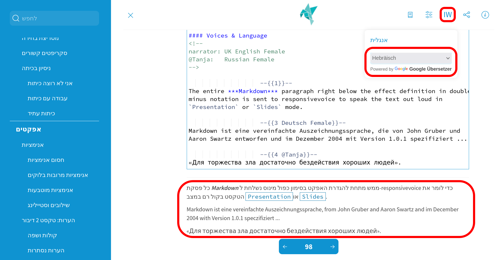

<!--

author:   André Dietrich
email:    LiaScript@web.de
date:     05/03/2024
version:  27.0.0
language: en
narrator: UK English Female

@Tanja:   Russian Female

@play: {!> @0}{<span style="display: inline-block; text-indent: -10000px">@1</span>}
@en: @play(UK English Male,@0)
@de: @play(Deutsch Male,@0)
@ru: @play(Russian Female,@0)
@ar: @play(Arabic @0,@1)

repository: https://github.com/LiaScript/docs

logo:     https://liascript.github.io/img/bg-showcase-1.jpg

comment:  This document shall provide an entire compendium and course on the
          development of Open-courSes with [LiaScript](https://LiaScript.github.io).
          As the language and the systems grows, also this document will be updated.
          Feel free to fork or copy it, translations are very welcome...

script:   https://cdn.jsdelivr.net/chartist.js/latest/chartist.min.js
          https://felixhao28.github.io/JSCPP/dist/JSCPP.es5.min.js

link:     https://cdn.jsdelivr.net/chartist.js/latest/chartist.min.css

link:     https://cdnjs.cloudflare.com/ajax/libs/animate.css/4.1.1/animate.min.css

import:   https://raw.githubusercontent.com/liaTemplates/ABCjs/main/README.md

link:     https://fonts.googleapis.com/css2?family=Noto+Sans+Egyptian+Hieroglyphs
          https://fonts.googleapis.com/css2?family=Noto+Sans+Ogham

font:     Noto Sans Egyptian Hieroglyphs, Noto Sans Ogham
-->


# Markdown Blocks

## **Table of Contents**

* [Lists](#Lists)

  - [Unordered List](#Unordered-List)
  - [Ordered List](#Ordered-List)

* [Blockquotes](#Blockquotes)

  - [Citations](#Citations)

* [Tables](#Tables)

  - [Tables ⟷ Data (Demo)](#Tables⟷Data-(Demo))
  - [Editing](#Editing)

* [HTML](#HTML)

  - [Details & Summary](#Details-&-Summary)
  - [<lia-keep>](#<lia-keep>)

* [Code](#Code)

  - [Differences to Markdown](#Differences-to-Markdown)
  - [Projects](#Projects)
  - [Supported Languages](#Supported-Languages)

* [JavaScript](#JavaScript)

* [Horizontal rules](#Horizontal-rules)

### **Lists**
-----------------

* The GitHub-flavored Markdown supports two types of lists, `ordered list and unordered list`, and so does LiaScript. If you ever used a typewriter then the following syntax for lists would look natural to you. 
* The only thing that matters here is the correct indentation.

> Use spaces for correct indentation! Tabs are allowed too, but might be confusing, since editors tend to use varying lengths from 2 to 4 spaces to display them...

#### **Unordered List**
----------------------

To define an unordered list, starting asterisks `*`, pluses `+`, and dashes `-` can be used and mixed. If one point has more than one line, you can also use multiple lines to define paragraphs. All other Markdown elements, you will get to know, can be included in the same way.

**Markdown-Syntax:**

> asterisk symbol (*) or hyphen symbol (-) or pluse symbol (+)

**Example 1:**

```
* Apple
* Banana
* Orange
* Mango
```
Output:

> * Apple
>
> * Banana
>
> * Orange
>
> * Mango

**Example2:**

```
* Fruits

 - Apple
 - Banana
 - Orange
 - Mango
```

Output:

> * Fruits
> 
>  - Apple
>
>  - Banana
>
>  - Orange
>
>  - Mango

**Example3:**

```
* Apples
+ **Bananas**
- Oranges
  and Lemons

  - Grapefruits
  - and Kiwis

- Pears
```
Output:

>* Apples
>+ **Bananas**
>- Oranges
>  and Lemons
>
>  - Grapefruits
>  - and Kiwis
>
>- Pears

As you can see from the result, you can apply all Markdown styling elements freely. The starting characters will be interpreted equally, thus it makes no difference, if you use asterisks, pluses and dashes. To improve the readability of your document, we would recommend to stick with one format for every level. Starting with asterisks on the first level and dashes within the second level, etc.


```
Note: At the moment it is required to separate blocks by at least one empty line. The following example will be interpreted as a single paragraph
```

```
* separate paragraph

  - and this is a separate sub listing
```

Output:

>* separate paragraph
>
>  - and this is a separate sub listing


#### **Ordered List**
-------------------------

Ordered lists start with a number and a dot. As you can see from the example, the numbering is important. In contrast to the GitHub flavored Markdown or the original Markdown, where the list below would result in two separate lists, and the numbering for every list would start at 1, ignoring your numbering order. With the LiaScript interpretation you can separate your lists, add more explanations in between, or use animations to make certain parts appear or disappear.

**Markdown-Syntax:**

>  start each item with a number followed by a period (.)

**Example1:**

```
1. First item
2. Second item
3. Third item
4. Fourth item
```

Output:

>1. First item
>2. Second item
>3. Third item
>4. Fourth item

**Example2:**

```
1. Introduction
2. Literature Review
3. Methodology
4. Results
5. Discussion
6. Conclusion
```
Output:

>1. Introduction
>2. Literature Review
>3. Methodology
>4. Results
>5. Discussion
>6. Conclusion

**Example3:**

```
1. Start the project
    1. Define project scope
    2. Gather necessary resources
2. Execute the project
    1. Implement plan
    2. Monitor progress
3. Complete the project
    1. Review outcomes
    2. Document results

```

Output:

>1. Start the project
>
>    1. Define project scope
>    2. Gather necessary resources
>
>2. Execute the project
>
>    1. Implement plan
>    2. Monitor progress
>
>3. Complete the project
>
>    1. Review outcomes
>    2. Document results

### **Blockquotes**
---------------------------

The blockquotes refers to the quotes that requires a special attention from the normal text. The blockquotes can be specified using the greater than symbol (>) at the starting line. If you, from time to time, reply to emails, than the following notation will look quite familiar to you.

**Markdown-Syntax:**

>greater than symbol (>)

**Example1:**

```
> This is a blockquote.
> It can span multiple lines.
> Blockquotes are often used to highlight or emphasize text.
```

Output:

>This is a blockquote.
>
>It can span multiple lines.
>
>Blockquotes are often used to highlight or emphasize text.

**Example2:**

```

> This is the outer blockquote.
>
> > This is a nested blockquote inside the outer blockquote.
> >
> > > This is a deeply nested blockquote within the nested blockquote.
>
> Back to the outer blockquote.
```

Output:

> This is the outer blockquote.
>
> > This is a nested blockquote inside the outer blockquote.
> >
> > > This is a deeply nested blockquote within the nested blockquote.
>
> Back to the outer blockquote.


**Example3:**

```
> This was said some time ago ...
>
>> This was said even longer ago,
> > I guess ...
>
> * aleph
> * beth
```

As you can see from the example, all Markdown elements can be used within a blockquote and vice versa. Everything you have learned so far can be easily combined, it could also be a gallery or an embedded object...

Output:

> This was said some time ago ...
>
>> This was said even longer ago,
> > I guess ...
>
> * aleph
> * beth


#### **Citations**
-------------------

Blockquotes are often used for citations, and so do we. You can use the following pattern to mark a blockquote as a citation. Simply use two paragraphs within a blockquote and start the second one with two dashes --.

**LiaScript-Syntax:**
>two dashes --.

**Example1:**

```
> “Live as if you were to die tomorrow.
> Learn as if you were to live forever.”
>
> -- Mahatma Gandhi
                   
```

The resulting blockquote looks slightly different. Furthermore, the paragraph followed by dashes is put into and HTML cite-tag.

> “Live as if you were to die tomorrow.
> Learn as if you were to live forever.”
>
> -- Mahatma Gandhi


You can use this syntax, with starting dashes, everywhere within a LiaScript document and your corresponding paragraph it will be rendered within a cite-tag. But, at this time it will only affect the representation of blockquotes. We are not sure yet, how this can also be applied to images, tables, lists, etc.

 
lorem ipsum ....

-- Some more citations


### **Tables**
--------------------------

Tables, as we hope, are easy to interpret and to create. Simply use horizontal rules to separate cells. The header is always defined by the first line, while the second line is used to separate the table header from the body visually and to define the column alignment.

* In Markdown, you create a table by using pipes | to separate columns and hyphens - to separate the header row from the content rows. Each row is separated by a newline. The pipes and hyphens must align vertically to create a proper table structure.

**Markdown-format:**

```
|  |  |
|--|--|
|  |  |
|  |  |
|  |  |
```

**Example1:**

```
| Fruit    | Quantity | Price |
|----------|----------|-------|
| Apple    | 3        | $1    |
| Banana   | 5        | $0.5  |
| Orange   | 2        | $2    |
```

Output:

>| Fruit    | Quantity | Price |
>|----------|----------|-------|
>| Apple    | 3        | $1    |
>| Banana   | 5        | $0.5  |
>| Orange   | 2        | $2    |


```
centered --> :---:
right --> ---:
left --> :--- or --- (default)
```


**Middle alignment**

**Example2:**

```
|  Fruit         |   Quantity     |  Price (USD)   |
|:--------------:|:--------------:|:--------------:|
|     Apple      |       3        |       $1       |
|    Banana      |       5        |      $0.5      |
|    Orange      |       2        |       $2       |
```

Output:

>|  Fruit         |   Quantity     |  Price (USD)   |
>|:--------------:|:--------------:|:--------------:|
>|     Apple      |       3        |       $1       |
>|    Banana      |       5        |      $0.5      |
>|    Orange      |       2        |       $2       |


**Left alignment**

**Example3:**

```
| Fruit         | Quantity       | Price (USD)   |
|:--------------|:--------------:|--------------:|
| Apple         | 3              | $1            |
| Banana        | 5              | $0.5          |
| Orange        | 2              | $2            |

```

Output:

>| Fruit         | Quantity       | Price (USD)   |
>|:--------------|:--------------:|--------------:|
>| Apple         | 3              | $1            |
>| Banana        | 5              | $0.5          |
>| Orange        | 2              | $2            |

**Right alignment**

**Example4:**

```
| Fruit         | Quantity       | Price (USD)   |
|--------------:|--------------:|--------------:|
| Apple         | 3              | $1            |
| Banana        | 5              | $0.5          |
| Orange        | 2              | $2            |
```

Output:

>| Fruit         | Quantity       | Price (USD)   |
>|--------------:|--------------:|--------------:|
>| Apple         | 3              | $1            |
>| Banana        | 5              | $0.5          |
>| Orange        | 2              | $2            |


**Example4:**

```
| Tables               |      Are      |  Cool |
| -------------------- |:-------------:| -----:|
| *** columns 3 is *** | right-aligned | $1600 |
| **column 2 is**      |   centered    |   $12 |
| *zebra stripes*      |   are neat    |    $1 |

```
As you can see in the result, you can sort tables, by clicking onto the icon that appears on the right of every header cell. A table will then be either sorted ascending, descending, or not sorted, which means your initial row order will be restored.

Output:

>| Tables               |      Are      |  Cool |
>| -------------------- |:-------------:| -----:|
>| *** columns 3 is *** | right-aligned | $1600 |
>| **column 2 is**      |   centered    |   $12 |
>| *zebra stripes*      |   are neat    |    $1 |

The position of the colon defines whether a column should be centered, aligned to the left or to the right. By default, if you do not use colons, all columns are aligned to the left.


#### **Tables <--> Data (Demo)**
------------------------------------

* But why stopping here? A table, in many cases, is just a representation of a dataset. If so, why not simply visualizing it accordingly and plot a graph, display a chart or a map, or whatever fits the most for your data. At the moment we apply simple rules to identify the nature of your dataset and thus choose a visual representation.

* For more details have a look at section Fun With Tables, which provides and extensive overview onto all supported representation schemes.

* The easiest and probably most obvious representation of a simple plot, would be the following. A header with some names and columns that contain numbers. The first column is interpreted as the main column and thus defines the x values, the rest is up to you. A cell is then only associated with a number, if the first "word", sequence of characters separated by a space, can be parsed as a number. The 0km within this example gets ignored. So if you want certain values to be ignored, simply attach something directly to the number, or add a character in front of it.


```
| x's |  some y's  |                  dist |
| --- |:----------:| ---------------------:|
| 1   |    1 \$    |                 16 km |
| 2.2 |    2 \$    |                 12 km |
| 3.3 |    5 \$    |                  1 km |
| 4   | -12.333 \$ | 0km _will be ignored_ |
```
                    

LiaScript identifies this pattern and automatically adds a button above the table, which allows to switch between the table and the "line chart" representation. You can modify the chart interactively and even download the resulting image.

>| x's |  some y's  |                  dist |
>| --- |:----------:| ---------------------:|
>| 1   |    1 \$    |                 16 km |
>| 2.2 |    2 \$    |                 12 km |
>| 3.3 |    5 \$    |                  1 km |
>| 4   | -12.333 \$ | 0km _will be ignored_ |


A function cannot possess different y-values for one x-value, thus, if you have two or more equal x-values, the resulting plot will be a scatter plot.

```
| x's |  some y's  |  dist |
| --- |:----------:| -----:|
| 1   |    1 \$    | 16 km |
| 2.2 |    2 \$    | 12 km |
| 3.3 |    5 \$    |  1 km |
| 4   | -12.333 \$ | -5 km |
| 4   |            |     1 |
```


>| x's |  some y's  |  dist |
>| --- |:----------:| -----:|
>| 1   |    1 \$    | 16 km |
>| 2.2 |    2 \$    | 12 km |
>| 3.3 |    5 \$    |  1 km |
>| 4   | -12.333 \$ | -5 km |
>| 4   |            |     1 |


Last but not least bar-charts. If the first column contains at least one cell, that cannot be parsed as a number while the others do have, then this table gets interpreted as a bar-chart. The first column thus defines your set of groups. It is now also possible to sort your table according to different columns, and to see this ordering also within the bar-chart representation.


```
| Animal          | weight in kg | Lifespan years | Mitogen |
| --------------- | ------------:| --------------:| -------:|
| Mouse           |        0.028 |             02 |      95 |
| Flying squirrel |        0.085 |             15 |      50 |
| Brown bat       |        0.020 |             30 |      10 |
| Sheep           |           90 |             12 |      95 |
| Human           |           68 |             70 |      10 |
```

>| Animal          | weight in kg | Lifespan years | Mitogen |
>| --------------- | ------------:| --------------:| -------:|
>| Mouse           |        0.028 |             02 |      95 |
>| Flying squirrel |        0.085 |             15 |      50 |
>| Brown bat       |        0.020 |             30 |      10 |
>| Sheep           |           90 |             12 |      95 |
>| Human           |           68 |             70 |      10 |

As mentioned earlier, this is only a brief introduction into this topic. So check out section Fun With Tables for a complete overview.

#### **Editing**
---------------------

Editing tables might seem tedious, but actually it is not. There is a huge number of plugins for different editors that you can use, which do the formatting for you. You can use them to quickly navigate through your cells, and some even allow sorting.


**Editors: Plugins**

* Atom:[markdown-table-editor](https://github.blog/2022-06-08-sunsetting-atom/)
* VS-Code:[Markdown Table](https://marketplace.visualstudio.com/items?itemName=TakumiI.markdowntable)
* Obsidion:[Advanced Tables](https://github.com/tgrosinger/advanced-tables-obsidian) 

### **HTML**
--------------------

You can also use plain HTML in your Markdown, if you miss something. It will mostly work pretty good, but it should be used with caution, since some interpreters apply different rules. Some interpret everything within an HTML tag as HTML, while others allow mixing. Thus, HTML can contain Markdown, which contains HTML, which contains... By the way, LiaScript allows mixing. Thus, keep in mind that newlines and indentation are still relevant.

**Markdown-Syntax:**

```
<div style="color: green">

Test <q>**bold**</q> and <b>HTML bold</b> works also inline


</div>

```

The result shows how the inline-CSS is applied to all nested Markdown elements. However, if you want to apply some styling to your document, LiaScript supports another minimal invasive way of doing that. We will describe this in detail in section Styling.

Result:

<div style="color: green">

Test <q>**bold**</q> and <b>HTML bold</b> works also inline


</div>


>See the following list for an complete overview onto all HTML elements:
>
>HTML Element Reference


If you use custom HTML instead of Markdown, then no styling will be applied. You can of course create more complex content or tables, this way you can apply your own styling to all elements.


[CSS-Reference](https://www.w3schools.com/CSSref/index.php)


If you want to, you can also copy the generated LiaScript structure and use our classes. Most Browsers include an inspector, which can be used to interactively inspect the entire DOM-tree.


Open Inspector: Ctrl+Shift+i or Ctrl+Shift+k

!?[Inspecting the DOM](https://youtu.be/Gk6BljF60RI)

But, you can also import your own styles within the main document comment by using the link definition. We will explain this in more details within the macro section [link](#link).

```
<!--
...
link: file.css
...
-->

# Main Title
```


#### **Details & Summary**
-----------------------


The `details` and `summary` tags are standard HTML tags and GitHub also supports their usage with Markdown. These tags offer a neat way to define something what is nowadays called accordion. Thus, your user can click on the summary text to make the body of the `details`-tag appear.

**Syntax:**

```
<details>

<summary>**Honest Textbook ads (click to enlarge)**</summary>

!?[If High School and College Textbooks Were Honest - Honest Ads](https://www.youtube.com/watch?v=lhSjYT7pWkw)

</details>
```

**Result:**

<details>

<summary>**Honest Textbook ads (click to enlarge)**</summary>

!?[If High School and College Textbooks Were Honest - Honest Ads](https://www.youtube.com/watch?v=lhSjYT7pWkw)

</details>

#### <lia-keep>

If you want to embed more complex HTML, and only HTML, without taking care about indentation and formatting, then should use the `lia-keep` tag to surround your code.

```
<`lia-keep`>
  <style>
    table, th, td {
      border: 1px solid black;
      width: 250px; height: 40px;
      text-align: center;
    }
  </style>

  <table style="margin: 1em">
    <tr>
      <th>**Header 1**</th>
      <th>**Header 2**</th>
    </tr>
    <tr>
      <td>Cell 1</td>
      <td rowspan="2">Cell 2</td>
    </tr>
    <tr>
      <td>Cell 3</td>
    </tr>
  </table>
<`/lia-keep`>
```


As it is demonstrated in the result, everything within this tag will be treated as HTML only, no Markdown parsing will be applied and indentation will be checked.

 
Result:

<style> table, th, td { border: 1px solid black; width: 250px; height: 40px; text-align: center; } </style>
**Header 1**	**Header 2**
Cell 1	Cell 2
Cell 3

This way, you could for example also import even more complex HTML-tables, pictures with multiple sources for different screen-sizes, and more. With great power comes great responsibility. Thus, you will also be responsibile for your styling.


### **Code**
----------------------

In Markdown, you can use a sequence of at least three subsequent backticks  to indicate a code-block that should not be treated as Markdown, but instead contains some kind of code for which syntax-highlighting should be used, if possible. The first word after the backticks is used as an indicator, for which kind of syntax-highlighting should be applied.

``` python
import time
# Quick, count to ten!
for i in range(10):
    # (but not *too* quick)
    time.sleep(0.5)
    print(i)
```


In case you are wondering, how to embed a code-block into a code-block with backticks? Three backticks are the minimum, thus you can surround your Markdown code-block example with a sequence of 4 or more backticks. If you start with four backticks, LiaScript will parse everything as code until it reaches a matching number of backticks.


``` 
import time
# Quick, count to ten!
for i in range(10):
    # (but not *too* quick)
    time.sleep(0.5)
    print(i)
```

However, we are still in the Markdown world with static code visualization. LiaScript has also support for interactive programming, thus all of your code-snippet can be made executable and editable. This will be described in more detail in section Interactive Coding.


#### **Differences to Markdown**

-----------

Markdown also supports adding code by using tilde `~` characters instead of backticks. This is at the moment not supported by LiaScript, but might be added in the future.

```
~~~ javascript
var a = "b"
~~~
```

Additionally, it is also possible in standard Markdown to use indentation with at least 4 spaces to mark a block or a line as code. In LiaScript this is treated differently. You can use indentation to keep your document readable. The two indicators for text-to-speech in the example are treated equally by LiaScript, but another Markdown interpreter will interpret the second example as a single paragraph, while the indicator in the first example will be treated as code, and thus be easier to read with any other Markdown interpreter (including the representation on GitHub).


```
This is not code ...

    Any kind of text with a 4 space
    indentation will be treated as code
    in Markdown ...

                --{{1}}--
This text will be spoken out loud in LiaScript.

--{{2}}--
This text will be spoken out loud too.
```

Result:

This is not code ...

      Any kind of text with a 4 space
      indentation will be treated as code
      in Markdown ...

                --{{1}}--
This text will be spoken out loud in LiaScript.

--{{2}}--
This text will be spoken out loud too.


#### **Projects **
----------------

If you want to bundle a couple of code-blocks into something that mirrors a project, you can achieve this with the following syntax. All code-blocks are simply attached to each other, in order to indicate a grouping. If you separate them at least by one newline, they will be treated separately. This will be pretty neat, if we introduce the concept of interactive code-blocks.

````

``` js     -EvalScript.js
let who = data.first_name + " " + data.last_name;

if(data.online) {
  who + " is online"; }
else {
  who + " is NOT online"; }
```

``` json    +Data.json
{
  "first_name" :  "Sammy",
  "last_name"  :  "Shark",
  "online"     :  true
}
```
````

You can define optional names within the head of your code-block. The starting plus + and minus - symbols are used to indicate, if the resulting code-blocks should be visible or hidden. However, you can change this, by clicking onto the resulting title-bar to either maximize or minimize the code-block.


``` js     -EvalScript.js
let who = data.first_name + " " + data.last_name;

if(data.online) {
  who + " is online"; }
else {
  who + " is NOT online"; }
```

``` json    +Data.json
{
  "first_name" :  "Sammy",
  "last_name"  :  "Shark",
  "online"     :  true
}
```

If you do not add a plus or a minus as a prefix to your file, the plus is used as default.


#### **Supported Languages** 
-------------------

In most cases you can simply add the name of the language or the common filename ending into the head of a code snippet. Most Markdown interpreters will use highlight.js for language rendering, since we require also an editor with syntax highlighting capabilities, we use ace. Thus, the language support might differ to other systems. We therefore apply a mapping, so that you can still use all highlight.js short-codes but also those of ace.

Overview: https://github.com/LiaScript/docs/blob/master/Code.md


### **JavaScript** 
--------------------

In contrast to common Markdown parsers or viewers, LiaScript allows you to include and execute JavaScript code. When combined with HTML elements, you are free to integrate whatever functionality you desire.


The last statement of your script also defines the result that will be shown, but only if it is not `undefined`. You can also use `console.log` to log the script activities. As the examples below show, you can combine your scripts with LiaScript animations, so they will only be executed in the right fragment/context. However, you can do much more with scripts.


>Checkout Section [JavaScript](#Javascript) for more information!


```markdown

Do some internal calculation <script> 99 * 88  </script>, the next script
contains an error <script> 99 * a </script>.

                                  {{2}}
<script>
    // Initialize a Line chart in the container with the ID chart
    new Chartist.Line('#chart', {
        labels: [1, 2, 3, 4],
        series: [[100, 120, 180, 200]]
    });

    console.debug("loaded #chart") // or undefined
</script>
<div class="ct-chart ct-golden-section" id="chart"></div>

```


Do some internal calculation <script> 99 * 88 </script>, the next script contains an error: <script> 99 * a </script>.

                              
<script>
// Initialize a Line chart in the container with the ID chart1
new Chartist.Line('#chart1', {
  labels: [1, 2, 3, 4],
  series: [[100, 120, 180, 200]]
});

console.debug("loaded #chart1")
</script>
<div class="ct-chart ct-golden-section" id="chart1"></div>


                                {{3}}
<script>
// Initialize a Line chart in the container with the ID chart2
new Chartist.Line('#chart2', {
  labels: [1, 2, 3, 4],
  series: [[-100, 120, 180, 20]]
});

console.debug("loaded #chart2")
</script>
<div class="ct-chart ct-golden-section" id="chart2"></div>


When discussing events, whether past, present, or future, your course may quickly become outdated. This is where scripts, as an initial building block, can shine. Using basic datetime calculations ensures precise determination of when events have occurred or will occur. Rather than relying solely on your calculations, users have the opportunity to inspect and validate your code by double-clicking on the highlighted script result. Even more, it is possible to modify the code, enabling them to double-check your findings and experiment with the results.

```Markdown
Russia started its invasion of Ukraine
<script format="relativetime" unit="day">
// Define the start date of the invasion
const invasionStartDate = new Date('2022-02-24');

// Get the current date
const currentDate = new Date();

// Calculate the difference in milliseconds
const differenceInMs = currentDate - invasionStartDate;

// Convert milliseconds to days
const differenceInDays = differenceInMs / (1000 * 60 * 60 * 24);

// Calculate the number of full days
const daysSinceInvasion = Math.floor(differenceInDays);

-daysSinceInvasion
</script>.
```


Russia started its invasion of Ukraine
<script format="relativetime" unit="day">
// Define the start date of the invasion
const invasionStartDate = new Date('2022-02-24');

// Get the current date
const currentDate = new Date();

// Calculate the difference in milliseconds
const differenceInMs = currentDate - invasionStartDate;

// Convert milliseconds to days
const differenceInDays = differenceInMs / (1000 * 60 * 60 * 24);

// Calculate the number of full days
const daysSinceInvasion = Math.floor(differenceInDays);

-daysSinceInvasion
</script>.


We combined scripts with the [Internationalization API](#Internationalization-API), which enables appropriate formatting of outputs. The days output is not hardcoded in our code. If we change the locale to another language, such as in the following example, the result will be optimized for the Russian language. Furthermore, by using the embedded Google Translator functions, the locale will be automatically set according to the selected language.

```Markdown
 Россия начала вторжение в Украину
<script format="relativetime" unit="day" locale="ru">
// Define the start date of the invasion
const invasionStartDate = new Date('2022-02-24');
...
```

Россия начала вторжение в Украину
<script format="relativetime" unit="day" locale="ru">
// Define the start date of the invasion
const invasionStartDate = new Date('2022-02-24');

// Get the current date
const currentDate = new Date();

// Calculate the difference in milliseconds
const differenceInMs = currentDate - invasionStartDate;

// Convert milliseconds to days
const differenceInDays = differenceInMs / (1000 * 60 * 60 * 24);

// Calculate the number of full days
const daysSinceInvasion = Math.floor(differenceInDays);

-daysSinceInvasion
</script>.

Now, imagine that instead of performing simple calculations, a script could access any kind of real-world data and output it as either HTML or LiaScript. What's more, picture scripts being directly combined with input fields, and a change in one script triggering the execution of another. All of this is possible in LiaScript. We have reimagined the usage of scripts as interactive powerhouses, and we will delve into the details in chapter [JavaScript or JS-Components](#JavaScript-or-JS-Components).


```markdown

longitude: <script default="13.33125" input="range" output="longitude">@input</script>

latitude: <script default="50.92558" input="range" output="latitude">@input</script>

<script run-once="true" style="display: block">
  fetch("https://api.open-meteo.com/v1/forecast?latitude=@input(`latitude`)&longitude=@input(`longitude`)&hourly=temperature_2m")
    .then(response => response.json())
    .then(data => {
      let table = "<!-- data-show data-type='line' data-title='Open-Meteo Wheather API' -->\n"

      table += "| Time | Temperature |\n"
      table += "| ---- | ----------- |\n"

      for (let i=0; i < data.hourly.time.length; i++) {
        table += "| " + data.hourly.time[i] + " | " + data.hourly.temperature_2m[i] + " |\n"
      }
      send.lia("LIASCRIPT: "+table) }
    )
    .catch(e => {
      send.lia("ups, something went wrong")
    })
  "waiting for the weather"
</script>

```

longitude: <script default="13.33125" input="range" output="longitude">@input</script>

latitude: <script default="50.92558" input="range" output="latitude">@input</script>

<script run-once="true" style="display: block">
  fetch("https://api.open-meteo.com/v1/forecast?latitude=@input(`latitude`)&longitude=@input(`longitude`)&hourly=temperature_2m")
    .then(response => response.json())
    .then(data => {
      let table = "<!-- data-show data-type='line' data-title='Open-Meteo Wheather API' -->\n"

      table += "| Time | Temperature |\n"
      table += "| ---- | ----------- |\n"

      for (let i=0; i < data.hourly.time.length; i++) {
        table += "| " + data.hourly.time[i] + " | " + data.hourly.temperature_2m[i] + " |\n"
      }
      send.lia("LIASCRIPT: "+table) }
    )
    .catch(e => {
      send.lia("ups, something went wrong")
    })
  "waiting for the weather"
</script>


### **Horizontal rules**

At the moment it is possible to insert horizontal rules by adding lines with at least 3 dashes, longer sequences of dashes are allowed too. Common Markdown also allows to define such rules with asterisks *, but this is used in LiaScript to group blocks, as we will described later...

**Markdown-Syntax:**

```
some paragraph

---

something else

----------------
```


Result:

some paragraph

---

something else

----------------

# State

Some words about state. The LiaScript runtime-environment preserves the internal state of the following elements, depending on where you execute your courses and depending on the version.

* [Tasks](#Tasks)
* [Quizzes](#Quizzes)
* [Surveys](#Surveys)
* Code
* `(<script>)`

LiaScript currently runs in three different environments. You can either share and read courses via the [project website](#project-website), generate [SCORM-packages](#SCORM-packages), which can be uploaded to an LMS, or create self-containing websites.

**1. LiaScript PWA**

If you share your course via the website, then all the courses and the current course states are preserved within the Browser database [IndexedDB](#IndexedDBS) locally. All of the states? Well ... the internal state of the previous components is only preserved, if your course has a version greater than or equal to `1.0.0`. The default version is `0.0.1`, which means that the course is in development mode, and thus the structure of your course might change every time. If a user reloads the course, then all states are cleared.

* Where:[https://liascript.github.io/course/](https://liascript.github.io/course/)

* Source: [liascript/src/typescript/connectors/Browser](https://github.com/LiaScript/LiaScript/tree/development/src/typescript/connectors/Browser)


2. SCORM 1.2

[SCORM](https://en.wikipedia.org/wiki/Sharable_Content_Object_Reference_Model) stands for Sharable Content Object Reference Model and allows you to store the course state directly within every LMS that has support for SCORM 1.2. For this case you have to use our [exporter](https://github.com/LiaScript/LiaScript-Exporter), which translates your course into a "SCORM-compliant" zip-file. You can check if your LMS has support for SCORM, by visiting our LMS-overview.

* Where: [https://github.com/LiaScript/LiaScript-Exporter#scorm12](https://github.com/LiaScript/LiaScript-Exporter#scorm12)
* Source: [liascript/src/typescript/connectors/SCORM1.2](https://github.com/LiaScript/LiaScript/tree/development/src/typescript/connectors/SCORM1.2)
* Does your LMS support SCORM 1.2: [LMS-Overview](https://github.com/LiaScript/LiaScript-Exporter#lms-support-list)

3. Base

You can also use our [exporter-tool](https://github.com/LiaScript/LiaScript-Exporter) to create single websites of your course. But, this "base" does only support to store user-settings, such as style, mode, etc. This "base-connector" is also used for the live-server and editors. If you are a developer and want to extend the LiaScript support to store state within your backend, then this is the right place to look at. This module provides an abstract class, to which all statefull data is sent. You can simply inherit from this class and implement the access to your system.

* Where: [https://github.com/LiaScript/LiaScript-Exporter#web](https://github.com/LiaScript/LiaScript-Exporter#web)

* Source: [liascript/src/typescript/connectors/Base](https://github.com/LiaScript/LiaScript/tree/development/src/typescript/connectors/Base)

For more information on versioning and how to use it, check out section [version](#version) within the [macros](#macros) section. But for now, it is okay to know, that you can adapt, restructure and share your courses freely, if you are in dev-mode. If your course is ready to be launched, use versioning to preserve the state of your users.


# **Tasks**
--------------

Before we show you how to create quizzes, we would like to introduce tasks, which were also a source of inspiration for us, for developing a similar syntax for quizzes and surveys. The GitHub flavored Markdown offers a very intuitive way of creating check-lists or task-lists.

```markdown
**Which topics did you master so far?**

- [ ] Biology
- [ ] Chemistry
- [ ] Computer Science
- [X] Something about LiaScript
```
It is basically a list where the brackets are used to symbolize check-boxes and by using an upper- or lowercase x, it is possible to mark a checkbox as checked. In LiaScript however, it is possible for the user to manipulate these states, and they will be preserved if your document is in version 1 or greater.

**Which topics did you master so far?**

- [ ] Biology
- [ ] Chemistry
- [ ] Computer Science
- [X] Something about LiaScript


## **Tasks and Scripting**
--------------------

In case you are wondering where the "Script" in LiaScript comes from? We wanted to make documents more interactive, by embedding native support for scripting. Coding will become an essential skill in the future so why not using it to directly extend the native capabilities of static documents and its elements. Scripts can either be executed separately or they can be attached to tasks, quizzes, surveys, and code-snippets.


The example might look a bit weird for the moment, but it is only meant as a demonstration. You can use scripting in LiaScript, if you want to, but it is not required. Thus, whenever you change the state of the task-list, then the script below gets executed and the `@input`-macro will be substituted by current input. `output="tasks"` says, that the result is published under the topic "tasks", thus, every script that contains an `@input(\`tasks\`)` will be executed afterwards as well with the changed input. Task-lists simply produces and array with boolean values.


```markdown

**What do you want to learn today?**

- [X] Biology
- [ ] Chemistry
<script output="tasks">"@input"</script>

<script style="width: 100%">
try {
  let task = @input(`tasks`) // interpret the output="tasks"

  if(task[0]) {
    send.liascript(`## Biology

Hey, great, you want to learn something about Biology.

* resource 1
* resource 2

The input from the tasks above was: [${task}]`)
  } else send.clear()
} catch(e) { }
</script>
```


Depending on the input scripts can generate different results, it is even possible to return LiaScript code, which will be analyzed and rendered dynamically. If an empty string or undefined gets returned, then the script will not be visible to the user. We will describe all Lia-Scripting capabilities and features in more detail in a later  [chapter](#javaScript-or-js-components).


**What do you want to learn today?**

- [X] Biology
- [ ] Chemistry
<script output="tasks">"@input"</script>

<script style="width: 100%">
try {
  let task = @input(`tasks`) // interpret the output="tasks"

  if(task[0]) {
    send.liascript(`## Biology

Hey, great, you want to learn something about Biology.

* resource 1
* resource 2

The input from the tasks above was: [${task}]`)
  } else send.clear()
} catch(e) { }
</script>


If we are talking about embedding scripts, that perform some kind of calculation, data analysis, etc. Why shouldn't this be visible to the user as well? We all know what can happen when you cannot get access to primary data and the code that was used to analyze it. In LiaScript you can inspect these highlighted elements with rounded corners, which represent the result of a script, simply by double-clicking or double-tabbing. The user can manipulate them and observe the results, simply by changing the code. If the editor is closed, then the code gets reevaluated.

> Europe's entire austerity policy after the debt crisis was based on wrong
> conclusions drawn from incorrect data and false calculations from a
> **single Excel spreadsheet**.
>
> https://en.wikipedia.org/wiki/Growth_in_a_Time_of_Debt

But, this is enough for the moment, let us continue with quizzes...

# **Effects**
---------------------

There are currently three types of effects that we call:

1. Animations

2. Comments via Text-to-Speech

3. and Playback functions

All of these elements can be used inline and as block-level elements. Every effect is defined by two braces:

```markdown
    --{{1}}--
Spoken comments.

     {{1-2}}
Blocks that appear at animation
step 1 and disappear on step 2.

     {{|>}}
To be read aloud when user clicks
the on the play button...
```

Animations are only visible, and comments are read aloud in "Presentation" or "Slides" mode. If you set the mode to "Textbook", then all animations and comments will be displayed on one slide where you have placed them within the document. In the other two modes, they are revealed step by step with each click.

                                {{3 |>}}
> __You need to balance these features properly so that your course can be read in Textbook mode and used for presentations and more.__


## **Animations**
----------------------

Animations are defined by two curly braces: one starting and one optional ending number. They can be associated with single blocks, multiple blocks, and also inline elements.

`{{start-stop?}} | {start-stop?}{inline}`

### **Block Animations**
------------------------------

Animations can be associated with blocks by adding two curly braces above the block. We recommend indenting the animation definition by at least 4 spaces. Other Markdown renderers will highlight this as code, making it easier to read.

```markdown

     {{1}}
This is an example for a *single* block animations.

     {{2-3}}
This one will appear on animation step 2 and disappear on 3.

{{4}} This is also ok, but it will look be harder to spot on GitHub.


```

Use a starting and an ending number, if you want the element to disappear at a certain point.

**Result:**


     {{1}}
This is an example for a *single* block animations.

     {{2-3}}
This one will appear on animation step 2 and disappear on 3.

{{4}} This is also ok, but it will look be harder to spot on GitHub.

### **Multi-Block Animations**
-----------------

Similarly to quizzes, as described in section [Quiz-Solution](#Solution), you can group multiple markdown blocks by lines of asterisks. Simply add the curly braces with the animation definition above the upper line.


```markdown


            {{1-2}}
************************************

This is an example...

| that     | contains |
|----------|----------|
| multiple | blocks.  |

************************************


             {{2}}
<section>

As an alternative, you can also use
HTML-tags ...


... to surround multiple blocks.

</section>

```

Blocks can also have a starting and disappearing number.

Depending on your preferred style, you can also use HTML tags to group blocks. These will then be displayed slightly differently on [GitHub](https://github.com/).


            {{1-2}}
************************************

This is an example...

| that     | contains |
|----------|----------|
| multiple | blocks.  |

************************************


             {{2}}
<section>

As an alternative, you can also use
HTML-tags ...


... to surround multiple blocks.

</section>

### **Inline Animations**
-----------------

Inline effects can be used in nearly all LiaScript elements. In this case, you will have to unpack the curly braces: the first pair surrounds the animation definition, while the second pair contains all inline elements that should appear and/or disappear.


```markdown
* no effect here
* but in this line {2}{show ***second***}
* as well as this one {1-2}{show ***first*** remove on __second__}

```

* no effect here
* but in this line {2}{show ***second***}
* as well as this one {1-2}{show ***first*** remove on __second__}


### **Combinations & Styling**
-------------------------

Animations can also be grouped freely, allowing one multi-block animation to contain multiple block animations, and one block can also contain further inline animations:

```markdown

<!--
class="animate__animated animate__backInUp"
style="background:#CCC; padding:3rem; min-height: 40vh; border-radius: 3rem"
-->
                 {{1}}
*******************************************

This block contains {2}{multiple} inline animations.
With some
{2-3}{styled}<!-- class="animate__animated animate__flash" -->
elements as well.

<!-- class="animate__animated animate__backInDown" -->
                  {{3}}
!?[Animated paintings](https://www.youtube.com/watch?v=-DDphfCnFQc&autoplay=true)

*******************************************
```

<!--
class="animate__animated animate__backInUp"
style="background:#CCC; padding:3rem; min-height: 40vh; border-radius: 3rem"
-->
                 {{1}}
*******************************************

This block contains {2}{multiple} inline animations.
With some
{2-3}{styled}<!-- class="animate__animated animate__flash" -->
elements as well.

<!-- class="animate__animated animate__backInDown" -->
                  {{3}}
!?[Animated paintings](https://www.youtube.com/watch?v=-DDphfCnFQc&autoplay=true)

*******************************************

Any kind of CSS can also be added to an animation, as described in the section on [Custom Styling](#Custom-Styling). Additionally, we have included an additional CSS stylesheet in the main HTML comment of this document. This will load [Animate CSS](https://animate.style/#documentation), but you can use any other CSS library or custom styling as well.

Animate.css documentation: [https://animate.style](https://animate.style/)

```markdown
<!--
author: ...

link:   https://cdnjs.cloudflare.com/ajax/libs/animate.css/4.1.1/animate.min.css
-->

# LiaScript
```


## **Comments: Text 2 Speech**
--------------------------------

The idea of a comment is that they should be associated with animations. When animation 𝑥 is revealed, then the comment 
𝑥 is read aloud. Similar to a PowerPoint presentation, when one element appears and the presenter says something, then clicks and the next element appears and is also commented. Thus, a comment is a paragraph that is marked by two sets of curly braces, which contain a number, and two dashes around the braces. If multiple comments have the same number, then they will be replayed in the order of appearance.

```markdown

          --{{1}}--
This will be spoken out loud.

          --{{2}}--
This will be spoken out loud too,
but at animation step 2.

          --{{2}}--
Don't forget me.

            {{1}}
__I am animation 1 {2}{and 2 too}.__

```

          --{{1}}--
This will be spoken out loud.

          --{{2}}--
This will be spoken out loud too,
but at animation step 2.

          --{{2}}--
Don't forget me.

            {{1}}
__I am animation 1 {2}{and 2 too}.__

If you change the presentation mode, you will notice that these comments will be displayed in place in "Textbook" mode. In "Slides" mode, they will also be presented to the user, while they will be hidden in "Presentation" mode. If you switch off the sound, then this is the mode that can be used for presenting content, while the others can be used for self-studying.

### **Voices & Language**
----------------

But where does the voice come from? In LiaScript, within the initial comment, you can use the `language` macro to define the document translation and `narrator` to define the default voice. Currently, we are using [responsivevoice](https://responsivevoice.org/) as a backup solution if your browser does not support text-to-speech. Otherwise, your default browser and operating system text-to-speech is utilized, which can vary across browsers and systems. Within the settings, it is possible to switch between the browser and backup TTS. It is possible to change the   `narrator` on different layers: globally within the main comment tag, per slide, and also per comment, by inserting the voice into the comment definition.

1. Backup Speech-Engine: [https://responsivevoice.org](https://responsivevoice.org/)
2. Default `narrator` must be defined within the initial comment, otherwise `US English Male` is used
3. You can overwrite the default `narrator` per slide, by attaching a comment to the title tag
4. Use `--{{number}}--` to indicate what is spoken and when
5. Use `--{{number voice}}--` to change the voice for this particular comment
6. It is also possible to define custom macros for language definitions
7. You can have multiple comments with the same number, those will be combined, but only the voice of the first one is used
8. See a complete list of all supported voices in section `[narrator]`(#narrator)


```markdown
<!--
author:   ...
language: en
narrator: US English Male
-->

# Title

...

#### Voices & Language
<!--
narrator: UK English Female
@Tanja:   Russian Female
-->

                    --{{1}}--
The entire ***Markdown*** paragraph right below the effect definition in double
minus notation is sent to responsivevoice to speak the text out loud in
`Presentation` or `Slides` mode.

                    --{{3 Deutsch Female}}--
Markdown ist eine vereinfachte Auszeichnungssprache, die von John Gruber und
Aaron Swartz entworfen und im Dezember 2004 mit Version 1.0.1 spezifiziert ...

                    --{{4 @Tanja}}--
«Для торжества зла достаточно бездействия хороших людей».

```

                    --{{1}}--
The entire ***Markdown*** paragraph right below the effect definition in double
minus notation is sent to responsivevoice to speak the text out loud in
`Presentation` or `Slides` mode.

                    --{{3 Deutsch Female}}--
Markdown ist eine vereinfachte Auszeichnungssprache, die von John Gruber und
Aaron Swartz entworfen und im Dezember 2004 mit Version 1.0.1 spezifiziert ...

                    --{{4 @Tanja}}--
«Для торжества зла достаточно бездействия хороших людей».

### **Hidden Comments**
-----------

Sometimes, it might be necessary to add a comment or to read a part aloud to underline a certain point, which might be necessary in the narrated mode but not in the Textbook. Therefore, it is possible to put your TTS output into simple HTML comments. This won't be shown to anyone and also not visible on most other Markdown parsers and renderers.

```markdown

<!-- --{{1}}--
Speak this out, but do not show it to anyone.
-->
```

The associated hidden comment to this point will not be visible in Textbook mode!

### **Translations**
---------------

If you click on the language settings, you can either click on the element "Translate with Google (experimental)" and select another language. In this case, a JavaScript library will be injected that implements the translation feature. As you can see from the example, not all parts will be translated. Code blocks will not be translated by default, as well as comments that have been marked with another voice than the default. These comments remain as they are, while LiaScript tries to find an appropriate voice for the new language and gender.




You can attach specific parameters to the comment that prohibit or enforce translation. By default, Google will search for the `class` definition `translate` or `notranslate`, but other external browser plugins might also take into account the HTML5 attribute [`translate`](https://www.w3schools.com/tags/att_translate.asp). So it is always good to use both definitions.

```markdown

<!-- class="notranslate" translate="no" style="color: red" -->
                    --{{2}}--
I will not be translated!

                    --{{3 Russian Female}}--
«Для торжества зла достаточно бездействия хороших людей».

```

<!-- class="notranslate" translate="no" style="color: red" -->
                    --{{2}}--
I will not be translated!

                    --{{3 Russian Female}}--
«Для торжества зла достаточно бездействия хороших людей».


You can attach these language attributes to any kind of Markdown block or inline element to control the translation. Note that code environments and foreign language comments will be tagged automatically with no-translate.

## **Playback**
------------------

Since Text2Speech output is integrated into the LiaScript notation, it can be intentionally used for language learners. Simply add a stylized play button to the effect definition to indicate what should be spoken out loud. You can also use different voices.

```markdown

    {{|>}}
This entire paragraph will be spoken out __LOUD__.

    {{!> Australian Female}}
* But in this case, this can also be combined
* with a couple of
* - different
  - Markdown elements
  - whether it makes sense or not.
  
```

      {{|>}}
This entire paragraph will be spoken out __LOUD__.

    {{!> Australian Female}}
* But in this case, this can also be combined
* with a couple of
* - different
  - Markdown elements
  - whether it makes sense or not.


### **Playback-Blocks**
-------------------------

And, as introduced for animations, you can also group multiple blocks together. Simply add as many Markdown blocks between two lines of asterisks, and they will be interpreted as one larger block.

```markdown

<!--style="background: #EEE; padding:2rem"-->
                  {{|>}}
**************************************************
This entire paragraph will be spoken out __LOUD__.

* But in this case, this can also be combined
* with a couple of
* - different
  - Markdown elements
  - whether it makes sense or not.

**************************************************

```

<!--style="background: #EEE; padding:2rem"-->
                  {{|>}}
**************************************************
This entire paragraph will be spoken out __LOUD__.

* But in this case, this can also be combined
* with a couple of
* - different
  - Markdown elements
  - whether it makes sense or not.

**************************************************

As an alternative, you can also use an HTML tag like `<section>` or `<div>` to group blocks. The LiaScript result will remain the same, but it will be rendered differently on other Markdown interpreters.

### **Playback-Inlines**
------------------------

Like in the presented example, the exclamation will not interfere with the table definition. And as presented before, you can also use inlining for Playback elements, as it was used for animations, by simply using two pairs of braces. Depending on your preferences and the current context, it is also possible to define the stylized play-button with a vertical line or an exclamation mark. Like in the presented example, the exclamation will not interfere with the table definition.

```markdown

| English              | German                            | Russian                                 | Arabic male               | Arabic female               |
| -------------------- |:--------------------------------- |:--------------------------------------- |:------------------------- | --------------------------- |
| {!>}{I go}           | {!> Deutsch Male}{ich gehe}       | {!> Russian Male}{я хожу}               | {!> Arabic Male}{أذْهبُ}  |                             |
| {!>}{you go}         | {!> Deutsch Male}{du gehst}       | {!> Russian Male}{ты ходишь}            | {!> Arabic Male}{تذْهبُ}  | {!> Arabic Female}{تذْهبين} |
| {!>}{he/she/it goes} | {!> Deutsch Male}{er/sie/es geht} | {!> Russian Male}{он / она / оно ходит} | {!> Arabic Male}{يذْهبُ}  | {!> Arabic Female}{تذْهبُ}  |
| {!>}{we go}          | {!> Deutsch Male}{wir gehen}      | {!> Russian Male}{мы ходим}             | {!> Arabic Male}{نذْهبُ}  |                             |
| {!>}{you go}         | {!> Deutsch Male}{ihr geht}       | {!> Russian Male}{вы ходите}            | {!> Arabic Male}{تذْهبون} | {!> Arabic Female}{تذْهبْن} |
| {!>}{they go}        | {!> Deutsch Male}{sie gehen}      | {!> Russian Male}{они ходят}            | {!> Arabic Male}{يذْهبون} | {!> Arabic Female}{يذْهبْن} |


```

The result is displayed within the table; all elements can be played on demand.

| English              | German                            | Russian                                 | Arabic male               | Arabic female               |
| -------------------- |:--------------------------------- |:--------------------------------------- |:------------------------- | --------------------------- |
| {!>}{I go}           | {!> Deutsch Male}{ich gehe}       | {!> Russian Male}{я хожу}               | {!> Arabic Male}{أذْهبُ}  |                             |
| {!>}{you go}         | {!> Deutsch Male}{du gehst}       | {!> Russian Male}{ты ходишь}            | {!> Arabic Male}{تذْهبُ}  | {!> Arabic Female}{تذْهبين} |
| {!>}{he/she/it goes} | {!> Deutsch Male}{er/sie/es geht} | {!> Russian Male}{он / она / оно ходит} | {!> Arabic Male}{يذْهبُ}  | {!> Arabic Female}{تذْهبُ}  |
| {!>}{we go}          | {!> Deutsch Male}{wir gehen}      | {!> Russian Male}{мы ходим}             | {!> Arabic Male}{نذْهبُ}  |                             |
| {!>}{you go}         | {!> Deutsch Male}{ihr geht}       | {!> Russian Male}{вы ходите}            | {!> Arabic Male}{تذْهبون} | {!> Arabic Female}{تذْهبْن} |
| {!>}{they go}        | {!> Deutsch Male}{sie gehen}      | {!> Russian Male}{они ходят}            | {!> Arabic Male}{يذْهبون} | {!> Arabic Female}{يذْهبْن} |


### **Hiding Text**
----------------------

If you only want to show the play buttons but not the text, it is possible to use some HTML tricks. The easiest way is to put your text into an HTML element and to remove it from the screen by using a `span` whose content is shifted off the screen. Simply styling the element with `display: none` will not work, since the TTS function requires the text to be rendered within the DOM, and the translation via Google will not work if the element is not visible.

But, since it is possible to define custom [Macros](#Macros), we can also apply a more elegant way. We define a set of local macros directly within a comment attached to the current heading. The `@play` macro has two parameters, one for the voice and the other for the text; the other macros are simply shortcuts for the voice that pass the text as the second parameter to the `@play`macro. Within the Arabic macro, it is also possible to define the gender of the narrator.

```markdown

#### Hiding Text
<!--
@play: {!> @0}{<span style="display: inline-block; text-indent: -10000px">@1</span>}
@en: @play(UK English Male,@0)
@de: @play(Deutsch Male,@0)
@ru: @play(Russian Female,@0)
@ar: @play(Arabic @0,@1)
-->

| go        |         EN          |         DE          |            RU             |      AR male      |      AR female      |
| --------- |:-------------------:|:-------------------:|:-------------------------:|:-----------------:|:-------------------:|
| I         |      @en(I go)      |    @de(ich gehe)    |        @ru(я хожу)        | @ar(Male,أذْهبُ)   |                     |
| you       |     @en(you go)     |    @de(du gehst)    |      @ru(ты ходишь)       | @ar(Male,تذْهبُ)   | @ar(Female,تذْهبين) |
| he/she/it | @en(he/she/it goes) | @de(er/sie/es geht) | @ru(он / она / оно ходит) | @ar(Male,يذْهبُ)   | @ar(Female,تذْهبُ)   |
| we        |     @en(we go)      |   @de(wir gehen)    |       @ru(мы ходим)       | @ar(Male,نذْهبُ)   |                     |
| you       |     @en(you go)     |    @de(ihr geht)    |      @ru(вы ходите)       | @ar(Male,تذْهبون) | @ar(Female,تذْهبْن)  |
| they      |    @en(they go)     |   @de(sie gehen)    |      @ru(они ходят)       | @ar(Male,يذْهبون) | @ar(Female,يذْهبْن)  |

```

The outcome is a table with playback buttons only, where the text is concealed, and the primary language will be translated while the other languages remain unchanged.


| go        |         EN          |         DE          |            RU             |      AR male      |      AR female      |
| --------- |:-------------------:|:-------------------:|:-------------------------:|:-----------------:|:-------------------:|
| I         |      @en(I go)      |    @de(ich gehe)    |        @ru(я хожу)        | @ar(Male,أذْهبُ)  |                     |
| you       |     @en(you go)     |    @de(du gehst)    |      @ru(ты ходишь)       | @ar(Male,تذْهبُ)  | @ar(Female,تذْهبين) |
| he/she/it | @en(he/she/it goes) | @de(er/sie/es geht) | @ru(он / она / оно ходит) | @ar(Male,يذْهبُ)  | @ar(Female,تذْهبُ)  |
| we        |     @en(we go)      |   @de(wir gehen)    |       @ru(мы ходим)       | @ar(Male,نذْهبُ)  |                     |
| you       |     @en(you go)     |    @de(ihr geht)    |      @ru(вы ходите)       | @ar(Male,تذْهبون) | @ar(Female,تذْهبْن) |
| they      |    @en(they go)     |   @de(sie gehen)    |      @ru(они ходят)       | @ar(Male,يذْهبون) | @ar(Female,يذْهبْن) |


### **Animations to Playback**
--------------------

Since we are utilizing the double braces notation for playback elements, this can also be combined with animations by adding appearance and disappearance numbers. Depending on the current state of the animation, this will result in different sentences.

```markdown

    {{1 |>}}
This is an example where {|> 1-2}{I go} _{|> 2}{I am going}_ to work.
```

You need to keep in mind that this will function as intended only if the user is not in Textbook mode. Otherwise, all elements will be read out loud, and nothing will be hidden.

    {{1 |>}}
This is an example where {|> 1-2}{I go} _{|> 2}{I am going}_ to work.


# **Charts**
--------------

In many cases, a diagram is only used to present some kind of signal paths, primitive functions, clusters, or point clouds. While you can still generate images for these tasks, why not apply some basic ASCII art to solve the most common tasks? Using ASCII art can be a lightweight and versatile way to represent such simple structures, saving time and effort compared to creating and embedding images.

              Dunning-Krueger-Effect
100 |   *
    |                                               *
  C |    *                                     *
  o |
  n |  *  *                                 *
  f |
  i |      *
  d |                                   *
  e | *     *
  n |
  c |         *                  *
  e |           *            *
    |*               *
  0 +-----------------------------------------------
     0              Competence                   100


## **Line-Plot Basics**
----------------------

As with the previous ASCII art examples, LiaScript has a special notation for simple line plots. These do not have to be surrounded by a code block; the LiaScript interpreter will detect them automatically based on their shape. However, it is recommended to add 4 spaces before such an image. This has the effect that any other Markdown viewer will interpret this as a code block, preserving the spaces and tabs.

**Markdown-format:**


```markdown

                                      diagram title
    1.5 |           *
        |                                 (* stars)
      y |        *      *
      - |      *          *
      a |     *             *       *
      x |    *                 *
      i |   *
      s |  *
        | *                              *        *
      0 +------------------------------------------
        2.0              x-axis                100       

```


As you can see from the rendered image below, you can add axis names and values, a diagram title, and a legend, which is originally surrounded by parenthesis. The positions of points are automatically calculated based on the given length of the two axes.


                                      diagram title
    1.5 |           *
        |                                 (* stars)
      y |        *      *
      - |      *          *
      a |     *             *       *
      x |    *                 *
      i |   *
      s |  *
        | *                              *        *
      0 +------------------------------------------
        2.0              x-axis                100

All diagram titles, labels, and limits are optional. If you do not define limits, then the minimum and maximum values 0 and 1 are used by default.

```markdown

     1 |                   *                       *
       |               *       *               *       *
       |*             *         *             *         *
y-axis | *           *           *           *           *
       |  *         *             *         *             *
       |   *       *               *       *               *
       |       *                       *                      *
    -1 +--------------------------------------------------------
```


     1 |                   *                       *
       |               *       *               *       *
       |*             *         *             *         *
y-axis | *           *           *           *           *
       |  *         *             *         *             *
       |   *       *               *       *               *
       |       *                       *                      *
    -1 +--------------------------------------------------------


## **Multi-Line-Plots**
-----------------------

Next to stars, you can also use any kind of character to define another line, where the character defines the color. For example, an `r` marks the color red, and an `A` represents the color amber.

**LiaScript-format:**

```markdown


    | r          *                                    (* stars)
    |    r                     A   A   A   A   A      (r imaginary course)
    |       r *      *       A   A   A   A   A   A    (A big triangles)
    |        * r       *
    |       *      r      *       *
    |      *            r    *
    |     *                 r
    |   *                          r
    | *                              *    r    *
    +-------------------------------------------
```

As you can see in the result, the characters do not only contain color information. Upper and lowercase characters also define the size of the dots plotted, and even more than this, they define the shape. For example, with r you can think of small round and red dots, while A looks like a large triangle. That is why some lines are rather smoothly interpolated, and the A, for example, defines sharp lines. More on this can be found in section [Shapes](#Shapes).


    | r          *                                    (* stars)
    |    r                     A   A   A   A   A      (r imaginary course)
    |       r *      *       A   A   A   A   A   A    (A big triangles)
    |        * r       *
    |       *      r      *       *
    |      *            r    *
    |     *                 r
    |   *                          r
    | *                              *    r    *
    +-------------------------------------------


## **Dot-Plots**
---------------

If there are more points with the same character for one x-value, then only dots are plotted. By using upper and lower case characters, you can also define the size and the shape of the dots.

**LiaScript-format:**


```markdown

    10 |        rrrrrrrrrrrr    x
       |    rrrrrrrrrrrrrrrr
       |  rrrrrrrrrrrrrrrrr  BBBBB
       | rrrrrrrrrrrrrrrr  BBBBBBBB
       |rrrrrrrrrrrrrrr  BBBBBBBBBBB
       |rrrrrrrrrrrrr  BBBBBBBBBBBBB
       |rrrrrrrrrrr  BBBBBBBBBBBBBBB
       | rrrrrrrr  BBBBBBBBBBBBBBBB
       |  rrrrr  BBBBBBBBBBBBBBBBB
       |        BBBBBBBBBBBBBBBB
       |   x    BBBBBBBBBBBBB
       +-----------------------------
         0                           2

```         


    10 |        rrrrrrrrrrrr    x
       |    rrrrrrrrrrrrrrrr
       |  rrrrrrrrrrrrrrrrr  BBBBB
       | rrrrrrrrrrrrrrrr  BBBBBBBB
       |rrrrrrrrrrrrrrr  BBBBBBBBBBB
       |rrrrrrrrrrrrr  BBBBBBBBBBBBB
       |rrrrrrrrrrr  BBBBBBBBBBBBBBB
       | rrrrrrrr  BBBBBBBBBBBBBBBB
       |  rrrrr  BBBBBBBBBBBBBBBBB
       |        BBBBBBBBBBBBBBBB
       |   x    BBBBBBBBBBBBB
       +-----------------------------
         0                           2


## **Colors**
------------------------

The color codes are somehow defined by the character itself, as seen in the list. The commonly used `x`,`+`, `*`, `#` stand for black, while `g` indicates green, and we had to use `e` for ebony (brown) since  `b` has to be blue. We hope the color codes mostly make sense.

| char               | color        | hex        |                                 example                                 |
| ------------------ | ------------ | ---------- |:-----------------------------------------------------------------------:|
| `x`, `+`, `*`, `#` | black        | `#1000000` | <div style="background-color:#000000; width: 100%; height: 2rem"></div> |
| `a`                | Amber        | `#FFBF00`  | <div style="background-color:#FFBF00; width: 100%; height: 2rem"></div> |
| `b`                | Blue         | `#0000FF`  | <div style="background-color:#0000FF; width: 100%; height: 2rem"></div> |
| `c`                | Cyan         | `#00FFFF`  | <div style="background-color:#00FFFF; width: 100%; height: 2rem"></div> |
| `d`                | Dark red     | `#8B0000`  | <div style="background-color:#8B0000; width: 100%; height: 2rem"></div> |
| `e`                | Ebony        | `#555D50`  | <div style="background-color:#555D50; width: 100%; height: 2rem"></div> |
| `f`                | Forest green | `#014421`  | <div style="background-color:#014421; width: 100%; height: 2rem"></div> |
| `g`                | Green        | `#008000`  | <div style="background-color:#008000; width: 100%; height: 2rem"></div> |
| `h`                | Heliotrope   | `#DF73FF`  | <div style="background-color:#DF73FF; width: 100%; height: 2rem"></div> |
| `i`                | Indigo       | `#4B0082`  | <div style="background-color:#4B0082; width: 100%; height: 2rem"></div> |
| `j`                | Jade         | `#00A86B`  | <div style="background-color:#00A86B; width: 100%; height: 2rem"></div> |
| `k`                | Kaki         | `#C3B091`  | <div style="background-color:#C3B091; width: 100%; height: 2rem"></div> |
| `l`                | Lime         | `#00FF00`  | <div style="background-color:#00FF00; width: 100%; height: 2rem"></div> |
| `m`                | Mint         | `#3EB489`  | <div style="background-color:#3EB489; width: 100%; height: 2rem"></div> |
| `n`                | browN        | `#88540B`  | <div style="background-color:#88540B; width: 100%; height: 2rem"></div> |
| `o`                | Orange       | `#FF7F00`  | <div style="background-color:#FF7F00; width: 100%; height: 2rem"></div> |
| `p`                | Pink         | `#FFC0CB`  | <div style="background-color:#FFC0CB; width: 100%; height: 2rem"></div> |
| `q`                | Queen blue   | `#436B95`  | <div style="background-color:#436B95; width: 100%; height: 2rem"></div> |
| `r`                | Red          | `#FF0000`  | <div style="background-color:#FF0000; width: 100%; height: 2rem"></div> |
| `s`                | Silver       | `#C0C0C0`  | <div style="background-color:#C0C0C0; width: 100%; height: 2rem"></div> |
| `t`                | Teal         | `#008080`  | <div style="background-color:#008080; width: 100%; height: 2rem"></div> |
| `u`                | Ultramarine  | `#3F00FF`  | <div style="background-color:#3F00FF; width: 100%; height: 2rem"></div> |
| `v`                | Violet       | `#EE82EE`  | <div style="background-color:#EE82EE; width: 100%; height: 2rem"></div> |
| `y`                | Yellow       | `#FFFF00`  | <div style="background-color:#FFFF00; width: 100%; height: 2rem"></div> |
| `w`                | White        | `#FFFFFF`  | <div style="background-color:#FFFFFF; width: 100%; height: 2rem"></div> |
| `z`                | Zomp         | `#39A78E`  | <div style="background-color:#39A78E; width: 100%; height: 2rem"></div> |


## **Shapes**
---------------------

The shape of the dot is also defined by the character, as seen in the example below. `T` stands for triangle, as well as `A`, which also makes a triangular shape. For the other characters, we had to make some decisions that hopefully make sense.

```markdown

6 | + * #           A a B b
  | C c D d E e F f G g H h
  | I i J j K k L l M m N n
  | o O P p Q q R r S s T t
  | U u V v W w X x Y y Z z
1 +------------------------
  0                      24
```

6 | + * #           A a B b
  | C c D d E e F f G g H h
  | I i J j K k L l M m N n
  | o O P p Q q R r S s T t
  | U u V v W w X x Y y Z z
1 +------------------------
  0                      24


## **Line types & Style**
---------------------------

As depicted in the line diagrams below, in addition to different colors, lines and dots can have different shapes, whether they are dashed, dotted, smoothed or not. And as for all other previous elements, you can apply custom styles, classes and modifiers too, by putting them into an HTML comment at the top of the diagram.

```markdown

    <!-- style="height: 700px" -->
    |   A     A     A     B     B     B     C     C     C
    |A  D  A  D  A  D  B  E  B  E  B  E  C  F  C  F  C  F
    |D  G  D  G  D  G  E  H  E  H  E  H  F  I  F  I  F  I
    |G  J  G  J  G  J  H  K  H  K  H  K  I  L  I  L  I  L
    |J  M  J  M  J  M  K  N  K  N  K  N  L  O  L  O  L  O
    |M  P  M  P  M  P  N  Q  N  Q  N  Q  O  R  O  R  O  R
    |P  S  P  S  P  S  Q  T  Q  T  Q  T  R  U  R  U  R  U
    |S  V  S  V  S  V  T  W  T  W  T  W  U  X  U  X  U  X
    |V  Y  V  Y  V  Y  W  Z  W  Z  W  Z  X  #  X  *  X  *
    |Y     Y     Y     Z     Z     Z     #     #     *
    +----------------------------------------------------
```


    <!-- style="height: 700px" -->
    |   A     A     A     B     B     B     C     C     C
    |A  D  A  D  A  D  B  E  B  E  B  E  C  F  C  F  C  F
    |D  G  D  G  D  G  E  H  E  H  E  H  F  I  F  I  F  I
    |G  J  G  J  G  J  H  K  H  K  H  K  I  L  I  L  I  L
    |J  M  J  M  J  M  K  N  K  N  K  N  L  O  L  O  L  O
    |M  P  M  P  M  P  N  Q  N  Q  N  Q  O  R  O  R  O  R
    |P  S  P  S  P  S  Q  T  Q  T  Q  T  R  U  R  U  R  U
    |S  V  S  V  S  V  T  W  T  W  T  W  U  X  U  X  U  X
    |V  Y  V  Y  V  Y  W  Z  W  Z  W  Z  X  #  X  *  X  *
    |Y     Y     Y     Z     Z     Z     #     #     *
    +----------------------------------------------------


And here is the same diagram, only for the lower case characters.

```markdown

    <!-- style="height: 700px" -->
    |   a     a     a     b     b     b     c     c     c
    |a  d  a  d  a  d  b  e  b  e  b  e  c  f  c  f  c  f
    |d  g  d  g  d  g  e  h  e  h  e  h  f  i  f  i  f  i
    |g  j  g  j  g  j  h  k  h  k  h  k  i  l  i  l  i  l
    |j  m  j  m  j  m  k  n  k  n  k  n  l  o  l  o  l  o
    |m  p  m  p  m  p  n  q  n  q  n  q  o  r  o  r  o  r
    |p  s  p  s  p  s  q  t  q  t  q  t  r  u  r  u  r  u
    |s  v  s  v  s  v  t  w  t  w  t  w  u  x  u  x  u  x
    |v  y  v  y  v  y  w  z  w  z  w  z  x     x     X
    |y     y     y     z     z     z
    +----------------------------------------------------

```

    <!-- style="height: 700px" -->
    |   a     a     a     b     b     b     c     c     c
    |a  d  a  d  a  d  b  e  b  e  b  e  c  f  c  f  c  f
    |d  g  d  g  d  g  e  h  e  h  e  h  f  i  f  i  f  i
    |g  j  g  j  g  j  h  k  h  k  h  k  i  l  i  l  i  l
    |j  m  j  m  j  m  k  n  k  n  k  n  l  o  l  o  l  o
    |m  p  m  p  m  p  n  q  n  q  n  q  o  r  o  r  o  r
    |p  s  p  s  p  s  q  t  q  t  q  t  r  u  r  u  r  u
    |s  v  s  v  s  v  t  w  t  w  t  w  u  x  u  x  u  x
    |v  y  v  y  v  y  w  z  w  z  w  z  x     x     X
    |y     y     y     z     z     z
    +----------------------------------------------------


# **JavaScript or JS-Components**
----------------------------------

  {{|> UK English Male}}
   
>As of the time of writing, I strongly believe that the script tag, introduced by Netscape in 1995 (cf. [Wikipedia](https://en.wikipedia.org/wiki/JavaScript#History)), is often misused. It remains somewhat outside of HTML, but if it could be embedded as part of the DOM, we wouldn't have to search the DOM for IDs and attempt to manipulate the content of a specific node. Much of the work we currently put into the development of Web Components could be achieved more easily by using the script tag in a slightly different manner.


In LiaScript, we now have the capability to insert scripts anywhere and connect them using a simple publish-subscribe mechanism. This allows us to create even more interactive books and courses. You can add additional calculations throughout your document, and the internal LiaScript event system handles their execution. This can be viewed as an inverse approach to Jupyter or R Notebooks, where content is structured around code for documentation purposes. Instead, we aim to integrate code as a native element within the content itself.


## **Script-Evaluation**
-----------------------------

To clarify some internals and how LiaScript handles the execution of scripts, let's describe the execution order:


<!--
style="
  display: block;
  margin-left: auto;
  margin-right: auto;
  max-width: 600px;
  fill: red;
  stroke: green;" -->
``` ascii
 +-------------------+
 |     README.md     |
 |                   |
 | ...               |
 |  <script>     +---+
 |    22*22      |  /
 |  </script>    | /
 | ...           |/
 +---------------+
          |
          |" {1}{(parse)} "
          V
 +-------------------+    "{3}{`22*22`}"   +------------------+
 |   "{2}{(ports)}"  +-------------------->|   "JavaScript "  |
 |                   |                     |                  |
 | " LiaScript/Elm " |<--------------------+   "{4}{(eval)}"  |
 +-------------------+    "{5}{`484`}"     +------------------+
```

* After parsing the script tag, LiaScript does not execute it directly. Instead, it is stored internally along with any possible output and connections to other scripts within an execution graph.

* Since LiaScript is implemented in Elm and Elm cannot directly execute JavaScript code, LiaScript uses a specific port to communicate with the outside world.

* When a script is ready, its code is sent as a string to the outside JavaScript world. LiaScript controls when and which code gets executed.

* The code is then evaluated.

* The result is sent back as a string to LiaScript. This string can be a certain value, HTML code, or even in LiaScript notation, which is then parsed internally again and displayed.


### **Simple scripts & scope**
-----------------------------

In its essence, a script is an inline element of LiaScript, similar to bold, italic text, or inline formulas. It performs simple calculations and prints its result exactly where the script is defined:

```markdown
$ \sin(\frac{\pi}{2}) = $ <script>Math.sin(Math.PI / 2)</script>
```

$ \sin(\frac{\pi}{2}) = $ <script>Math.sin(Math.PI / 2)</script>

1. That is the basic idea, nothing more and nothing less. The final "result" or expression of a script defines its output. Thus, the script with the alert gets executed, but it does not appear within the document, since `alert` evaluates to `undefined`. In this case, the script is expected to be hidden, without any visualization within the document.

```html

<script>
var a = 22**3

alert("Hello Mom")
</script>
```


<script>
var a = 22**3

alert("Hello Mom")
</script>

2. Such hidden scripts can be useful to trigger only an execution or to perform a certain action for manipulating the DOM or simply some maintenance work.

```html

<script>
document.getElementById("example").innerHTML = "Did execute"
console.log("executed script")
</script>

<h1 id="example">Not executed</h1>

```

<script>
document.getElementById("example").innerHTML = "Did execute"
console.log("executed script")
</script>

<h1 id="example">Not executed</h1>


 
<section>

3. Every script is executed in its own local scope, which means that the variable `a` defined in the "Hello Mom" example cannot be accessed in another script.Thus, if an error occurs, the error message is shown as a result of the evaluation.

``` html
<script> a * 33 </script>
```

---

<script> a * 33 </script>

</section>


4. If you wish to exchange information between scripts using variables, you must define them globally.

```html
<script> window.a = 22 ** 3 </script>

<script> window.a / 2 </script>
```

<script> window.a = 22 ** 3 </script>

<script> window.a / 2 </script>

If you were to reverse the order of the two scripts, dividing a by two would still result in the same error message, as scripts are executed sequentially and a must be defined first. Only after revisiting this slide, when both scripts are executed again, will the result of both scripts be correct. However, LiaScript sends all scripts to JavaScript in order, and while some scripts may execute faster than others, this can lead to race conditions. Therefore, there is a better approach to updating scripts, as described in section [Connecting Scripts with output](#Connecting-Scripts-with-output).

### **Combination with Animations**
--------------------

You can combine scripts with LiaScript animations to trigger their execution. In textbook mode, all scripts will be executed after the slide has been loaded. In other modes, if a script does not belong to an animation, it will be executed immediately when you open the slide or whenever you visit the slide.

```markdown

<script>alert("0")</script>

{{1}} <script>alert("1")</script>

{{2}} <script>alert("2")</script>

{{3}} <script>alert("3")</script>
```

<script>alert("0")</script>

{{1}} <script>alert("1")</script>

{{2}} <script>alert("2")</script>

{{3}} <script>alert("3")</script>


## **Asynchronous Execution & API**
-------------------------

A script gets executed, but you need to make an asynchronous call to an external API. How could you handle this? Well, in this case, LiaScript provides a `send` object for every execution, which can be used to directly communicate with the script state in the Elm world. By using `send.lia`, you can directly send strings back from every asynchronous execution path.

```markdown

<script>
setTimeout(function(){
  send.lia("I am ready!")
}, 5000)

"will wait for 5 seconds"
</script>
```

<script>
setTimeout(function(){
  send.lia("I am ready!")
}, 5000)

"will wait for 5 seconds"
</script>


### **Execution State**
---------------

Every script maintains an internal state. LiaScript is aware of which scripts have already been executed and which are still in the process of a long calculation. If a script returns a result or if `send.lia` is called, then the internal execution state is marked as inactive, which will trigger a new execution when the slide is revisited. Hence, a long-running script will not be restarted until it is finished. Thus, the previous example was not fully correct.


If you would like to create, for example, a clock or a running counter, every revisit would create a new script that might run forever, and all of these would communicate with the Elm part, resulting in glitches. However, like in the case of [executable code blocks](#send-object), there are different options that can be used to communicate with the internal representation. By returning `"LIA: wait"`, the LiaScript script state is informed that although the execution has finished, the process is still running. Since `send.lia` would mark an internal stop, you can use `send.output` to change the output asynchronously.


```markdown

<script>
setInterval(function(){
  i++
  send.output("counting " + i)
}, 1000)

var i = 0

"LIA: wait"
</script>
```

That's it. This script will run indefinitely, and it will not trigger a new evaluation because LiaScript keeps its internal state marked as active.

<script>
setInterval(function(){
  i++
  send.output("counting " + i)
}, 1000)

var i = 0

"LIA: wait"
</script>

However, you can trigger a stop after a long run by either calling `send.lia` again, which will also alter the result of the script representation, or you can send it a stop command, which is equivalent to sending `"LIA: stop"`. This stop command does not affect the last representation but only the state. This script will be started again when the user revisits the slide.

```markdown

<script>
var timerId = setInterval(function(){
  i++
  send.output("counting " + i)

  if (i > 10) {
    clearInterval(timerId);
    send.stop()
    // shortcut for send.lia("LIA: stop")
  }
}, 1000)

var i = 0
send.wait() // equal to send.lia("LIA: wait")
</script>
```

<script>
var timerId = setInterval(function(){
  i++
  send.output("counting " + i)

  if (i > 10) {
    clearInterval(timerId);
    send.stop()
    // shortcut for send.lia("LIA: stop")
  }
}, 1000)

var i = 0
send.wait() // equal to send.lia("LIA: wait")
</script>

In summary, you have three possibilities to send updates from your script: `send.lia` and `send.output`, while the second is used asynchronously and won't stop the active state. The three additional helper functions are simple shortcuts to inform LiaScript about state changes.

* `send.lia`
* `send.output`
* `send.wait` --> `"LIA: wait"`
* `send.stop` --> `"LIA: stop"`
* `send.clear` --> `LIA: clear`


## **Different Representations**
-----------------------

But it is not only possible to send back strings; well, technically it is still the case, but the strings might be represented differently. LiaScript allows the display of HTML and LiaScript code as well, which is then reparsed and thus allows for the recreation of nested structures as well.


<div style="width:100%;height:0;padding-bottom:71%;position:relative;"><iframe src="https://giphy.com/embed/fwbZnTftCXVocKzfxR" width="100%" height="100%" style="position:absolute" frameBorder="0" class="giphy-embed" allowFullScreen></iframe></div><p><a href="https://giphy.com/gifs/PLCnext-plcnext-phoenixcontact-plcnexttechnology-fwbZnTftCXVocKzfxR">via GIPHY</a></p>


### `HTML`
-------------------------

This first approach does obviously not work. LiaScript does not parse and interprete the return value on demand, instead, everything is interpreted and displayed as a string:

```markdown

<script>"<marquee>This text will scroll from right to left</marquee>"</script>
```

<script>"<marquee>This text will scroll from right to left</marquee>"</script>

Instead, we have to start the return string with `HTML:`, followed by whatever HTML code there is. Yes, we can style a script tag in our case, since it is commonly displayed only as an inline parameter. Thus, we can change its appearance to let the marquee tag use the full line width, and by using `modify`, we can prevent the user from inspecting the code, which also gets rid of the background.

```markdown

<script
  style="display: block"
  modify="false"
>
"HTML: <marquee>This text will scroll from right to left</marquee>"
</script>

```

<script
  style="display: block"
  modify="false"
>
"HTML: <marquee>This text will scroll from right to left</marquee>"
</script>

Of course, the following example could be optimized, but it is used to showcase the fact that it is also possible to mark strings as `HTML` by using `send.lia` or `send.output` for asynchronous tasks as well. In this case, not only the time is updated, but also the color is set to a random value.

```markdown

<script>
function randomColor() {
    return '#' + Math.floor(Math.random() * 16777215).toString(16);
}

function getTime() {
  const now = new Date();
  const hours = now.getHours().toString().padStart(2, '0');
  const minutes = now.getMinutes().toString().padStart(2, '0');
  const seconds = now.getSeconds().toString().padStart(2, '0');

  send.output(`HTML:
  <div style="font-size: 6rem;
    letter-spacing: 1rem;
    font-weight: bold;">
    <span style="color: ${randomColor()}; background: white; border-radius: 5px;">${hours}</span> :
    <span style="color: ${randomColor()}; background: white; border-radius: 5px;">${minutes}</span> :
    <span style="color: ${randomColor()}; background: white; border-radius: 5px;">${seconds}</span>
  </div>`)
}

setInterval(getTime, 1000)

send.wait()
</script>

```


<script>
function randomColor() {
    return '#' + Math.floor(Math.random() * 16777215).toString(16);
}

function getTime() {
  const now = new Date();
  const hours = now.getHours().toString().padStart(2, '0');
  const minutes = now.getMinutes().toString().padStart(2, '0');
  const seconds = now.getSeconds().toString().padStart(2, '0');

  send.output(`HTML:
  <div style="font-size: 6rem;
    letter-spacing: 1rem;
    font-weight: bold;">
    <span style="color: ${randomColor()}; background: white; border-radius: 5px;">${hours}</span> :
    <span style="color: ${randomColor()}; background: white; border-radius: 5px;">${minutes}</span> :
    <span style="color: ${randomColor()}; background: white; border-radius: 5px;">${seconds}</span>
  </div>`)
}

setInterval(getTime, 1000)

send.wait()
</script>

### `LIASCRIPT:`
---------------------------

Similar to `HTML`, it is also possible to return LiaScript content as a simple string, which is then parsed and its result gets displayed. In this example, for the formula, the backslash has to be escaped instead of escaping the `\f`, which does not make sense. The `run-once` option can be set to prevent the script from recalculating and thus reparsing the result again and again. When this option is set, the execution is done only once, and the result is statically stored within LiaScript.

```markdown
<script run-once>"LIASCRIPT: $$\\frac{1}{x} = 0$$"</script>
```

<script run-once>"LIASCRIPT: $$\\frac{1}{x} = 0$$"</script>

On the other hand, this can also contain more complex elements, such as tables, which can be modified and inspected interactively.

```markdown

<script style="display: block" run-once>
`LIASCRIPT:
<!-- data-show -->
| Animal          | weight in kg | Lifespan years | Mitogen |
| --------------- | ------------:| --------------:| -------:|
| Mouse           |        0.028 |              2 |      95 |
| Flying squirrel |        0.085 |             15 |      50 |
| Brown bat       |        0.020 |             30 |      10 |
| Sheep           |           90 |             12 |      95 |
| Human           |           68 |             70 |      10 |`
</script>
```

<script style="display: block" run-once>
`LIASCRIPT:
<!-- data-show -->
| Animal          | weight in kg | Lifespan years | Mitogen |
| --------------- | ------------:| --------------:| -------:|
| Mouse           |        0.028 |              2 |      95 |
| Flying squirrel |        0.085 |             15 |      50 |
| Brown bat       |        0.020 |             30 |      10 |
| Sheep           |           90 |             12 |      95 |
| Human           |           68 |             70 |      10 |`
</script>

This way, you could also generate new quizzes randomly, add executable code snippets, and even generate scripts dynamically. However, in the case of dynamically created LiaScript content, the state of quizzes, code, etc. is not stored permanently within the browser's IndexedDB. This is only possible for elements that are defined explicitly within the markdown document.

```markdown

<script style="display: block" modify="false">
// Generate two random numbers between 0 and 40
var a = Math.floor(Math.random() * 41);
var b = Math.floor(Math.random() * 41);

// Ensure b is not greater than a
if (b > a) {
  const temp = a;
  a = b;
  b = temp;
}

`LIASCRIPT: __What is ${a} - ${b} ?__

[[ ${ a - b } ]]`
</script>
```


<script style="display: block" modify="false">
// Generate two random numbers between 0 and 40
var a = Math.floor(Math.random() * 41);
var b = Math.floor(Math.random() * 41);

// Ensure b is not greater than a
if (b > a) {
  const temp = a;
  a = b;
  b = temp;
}

`LIASCRIPT: __What is ${a} - ${b} ?__

[[ ${ a - b } ]]`
</script>


Just think about the possibilities. We can not only create courses using AI, as described in the article, but we could also dynamically generate new quizzes, programming tasks, or discuss topics directly in LiaScript.


> __Act as a Learning Designer — Getting ChatGPT to Generate an Online Module__
>
> Source: https://aneesha.medium.com/act-as-a-learning-designer-getting-chatgpt-to-generate-an-online-module-8a16a2813bd6
>
> -- by Aneesha Bakharia

What is missing too is to interconnect scripts and utilize different input methods to generate different interactive scenarios, as it was done in the initial weather API example. Here we had also applied the simple `send` object, but the two scripts at the head are connected with an input range and publish their results on a topic defined within the `output` parameter. On every change, the evaluation of the third script is triggered, and the two `@input` markers are replaced accordingly.

```markdown

longitude: <script default="13.33125" input="range" output="longitude">@input</script>

latitude: <script default="50.92558" input="range" output="latitude">@input</script>

<script run-once="true" style="display: block">
  fetch("https://api.open-meteo.com/v1/forecast?latitude=@input(`latitude`)&longitude=@input(`longitude`)&hourly=temperature_2m")
    .then(response => response.json())
    .then(data => {
      let table = "<!-- data-show data-type='line' data-title='Open-Meteo Wheather API' -->\n"

      table += "| Time | Temperature |\n"
      table += "| ---- | ----------- |\n"

      for (let i=0; i < data.hourly.time.length; i++) {
        table += "| " + data.hourly.time[i] + " | " + data.hourly.temperature_2m[i] + " |\n"
      }
      send.lia("LIASCRIPT: "+table) }
    )
    .catch(e => {
      send.lia("ups, something went wrong")
    })
  "waiting for the weather"
</script>
```

longitude: <script default="13.33125" input="range" output="longitude">@input</script>

latitude: <script default="50.92558" input="range" output="latitude">@input</script>

<script run-once="true" style="display: block">
  fetch("https://api.open-meteo.com/v1/forecast?latitude=@input(`latitude`)&longitude=@input(`longitude`)&hourly=temperature_2m")
    .then(response => response.json())
    .then(data => {
      let table = "<!-- data-show data-type='line' data-title='Open-Meteo Wheather API' -->\n"

      table += "| Time | Temperature |\n"
      table += "| ---- | ----------- |\n"

      for (let i=0; i < data.hourly.time.length; i++) {
        table += "| " + data.hourly.time[i] + " | " + data.hourly.temperature_2m[i] + " |\n"
      }
      send.lia("LIASCRIPT: "+table) }
    )
    .catch(e => {
      send.lia("ups, something went wrong")
    })
  "waiting for the weather"
</script>


## **Input Types**
------------------------

Using only static scripts can be boring. We want to interact with the scripts and pass input values. In LiaScript, this is achieved through a combination of script tags with input tags. Simply add the parameter `input` with additional type information to the script tag.

```markdown
<script input value="reverse">
let str = "@input"
// the input string gets reversed
str.split("").reverse().join("")
</script>
```
Scripts that are combined with an input are marked by a thin frame. You can click on them and change the input. Different inputs produce different outputs and might trigger the execution slightly differently.

<script input value="reverse">
let str = "@input"
// the input string gets reversed
str.split("").reverse().join("")
</script>

Text inputs are evaluated immediately on every change. As you can see, after changing the input, such scripts store two states: the input value and the output of the calculation. Both values might be completely different.

> All possible types defined by the HTML5 standard can be used, along with their specific parameters.
> These are automatically passed to the generated input:
>
> https://www.w3schools.com/tags/tag_input.asp


### `text`
----------------

This is also the default input. It demonstrates the usage of the `@input` macro, which defines the location where the current input value should be placed. Since the input could be interpreted as a string in `""` or used as part of your code, you have to decide how to treat it. The attribute `value` is used as the default initial input for your script during the first execution. If no `value` is defined, then the default input is an empty string.


```markdown

<script input="text" value="reverse">
let str = "@input"
// the input string gets reversed
str.split("").reverse().join("")
</script>
```

<script input="text" value="reverse">
let str = "@input"
// the input string gets reversed
str.split("").reverse().join("")
</script>

> For more information about text inputs see:
>
> https://www.w3schools.com/tags/att_input_type_text.asp


### `button`
-----------------------

The code depicted below will implement a simple clickable button. As for all other script input combinations, except submit, the script execution will also be triggered when the script is loaded, to generate an output and afterwards on every click.

```markdown

<script input="button">
alert("click")

"click me"
</script>

```

<script input="button">
alert("click")

"click me"
</script>


> For more information about the button input see:
>
> https://www.w3schools.com/tags/att_input_type_button.asp


### `submit`
-----------------------

Similar to a `button` input, as described in section [button](#button), but with one intentional difference. The script of a submit input will not be executed when it initially appears; instead, it will only be executed if the user clicks on the button. Like `button`, `submit` does not have an internal value, only an output, and can be used to activate other scripts. Therefore, a default value must be defined initially, which also serves as the default output. This default value is used during parsing; for example, if a table is parsed with some scripts within the cells, then this value is used as a hint to identify the appropriate visualization.

```markdown

<script input="submit" default="click me">
alert("click")
Math.random()
</script>
```

<script input="submit" default="click me">
alert("click")
Math.random()
</script>


>For more information about the submit input see:
>
>https://www.w3schools.com/tags/att_input_type_submit.asp


### `number`
-------------------------

The number input is similar to text, but only numbers are allowed as input, and you can set additional parameters such as `min`, `max`, and `step`.


```markdown

<script input="number" value="1" min="0" max="1000000">
let i = @input // direct usage as a number

"Square of " + i + " = " + i * i
</script>
```


<script input="number" value="1" min="0" max="1000000">
let i = @input // direct usage as a number

"Square of " + i + " = " + i * i
</script>


>For more information about number inputs see:
>
>https://www.w3schools.com/tags/att_input_type_number.asp


### `range`
------------------------

The range input is actually a slider that generates numbers as input, and you can set additional parameters such as `min`, `max`, and `step`.

```markdown

<script input="number" value="1" min="0" max="1000" step="0.1">
let i = @input // direct usage as a number

"Square of " + i + " = " + i * i
</script>
```


<script input="number" value="1" min="0" max="1000" step="0.1">
let i = @input // direct usage as a number

"Square of " + i + " = " + i * i
</script>


>For more information about range inputs see:
>
>https://www.w3schools.com/tags/att_input_type_range.asp


### `search`
------------------------

The search input is actually a text input, but unlike regular text inputs, the script associated with it is only executed after the input field loses focus.

```markdown

<script input="search" value="abcdefg">
let str = "@input"

"reverse of \"" + str + "\" -> " + str.split("").reverse().join("")
</script>
```

<script input="search" value="abcdefg">
let str = "@input"

"reverse of \"" + str + "\" -> " + str.split("").reverse().join("")
</script>


>For more information about search inputs see:
>
>https://www.w3schools.com/tags/att_input_type_search.asp


### `password`
-------------------

The password input is also a text input, but unlike regular text inputs, the input characters are not directly visible. Similar to the search input, the script associated with it is only executed after the input field loses focus.

```markdown

<script input="password">
let password = "@input"

if (password == "LiaScript") {
  "You got it!"
} else {
  "please enter the correct password"
}
</script>
```


<script input="password">
let password = "@input"

if (password == "LiaScript") {
  "You got it!"
} else {
  "please enter the correct password"
}
</script>


>For more information about password inputs see:
>
>https://www.w3schools.com/tags/att_input_type_password.asp


### `radio`
----------------------------

In contrast to the common usage of radio buttons, which requires the definition of multiple radio inputs, LiaScript achieves the same with the `radio` input type and the definition of the `options` parameter. All possible options are separated by `|`. Thus, the user can only select one of the defined options.

```markdown
<script
input="radio" value="1"
options="1|2|3|Hello World|true"
>
"Selected option: @input"
</script>
```


<script
input="radio" value="1"
options="1|2|3|Hello World|true"
>
"Selected option: @input"
</script>


>`options` is not a standard HTML parameter, for more information on radio inputs see:
>
>https://www.w3schools.com/tags/att_input_type_radio.asp


### `select`
------------------------

`select` is not actually an input type, but we added it since it allows performing the same task as radio buttons, but with a representation as a drop-down list. The usage of `options` and their separation by `|` is similar to radio buttons.

```markdown

<script
input="select" value="1"
options="1|2|3|Hello World|true"
>
"Selected option: @input"
</script>
```


<script
input="select" value="1"
options="1|2|3|Hello World|true"
>
"Selected option: @input"
</script>


>`options` is not a standard HTML parameter, for more information on the select tag see:
>
>https://www.w3schools.com/tags/tag_select.asp


### `checkbox`
----------------------

Checkboxes, unlike radio buttons or select, allow you to select multiple elements at once or none. If no options are defined, a checkbox is treated as a single input that switches between true and false, depending on whether the checkbox is checked or not.


```markdown

<script input="checkbox" value="true">
"@input"
</script>
```

<script input="checkbox" value="true">
"@input"
</script>

If you define `options`, the current value as well as the result are treated as a list of strings in JSON format.

```markdown

<script input="checkbox" value='["Ben"]' options="Ben|Jerry|Tom|Hardy" >
@input
</script>
```

<script input="checkbox" value='["Ben"]' options="Ben|Jerry|Tom|Hardy" >
@input
</script>

This might not be sufficient or readable; therefore, it is also possible to define formats for outputs (see section [Formatting with Intl]((#Internationalization-API))). The `list` format, for example, allows you to add language-specific textual formatting for lists. If you do not specify locale information, the document language is used as a default.

```markdown

<script
  input="checkbox"
  value='["Ben", "Jerry", "Tom"]'
  options=" Ben | Jerry | Tom | Hardy "

  format="list" locale="en"
>
  let list = @input

  if (list.length == 0)
    ["no one"]
  else
    list
</script>
```


<script
  input="checkbox"
  value='["Ben", "Jerry", "Tom"]'
  options=" Ben | Jerry | Tom | Hardy "

  format="list" locale="en"
>
  let list = @input

  if (list.length == 0)
    ["no one"]
  else
    list
</script>


> For more information about checkbox inputs see:
>
> https://www.w3schools.com/tags/att_input_type_checkbox.asp


### **Date & Time**
--------------------------

#### `date`
----------------------

Date offers a datepicker. The normal return value is a string in the format `YYYY-MM-DD` (Year-Month-Day), but it is also possible to customize this output according to language-specific formats.

```markdown

<script input="date" value="2020-10-10"
        format="datetime" locale="de">
"@input"
</script>

```

<script input="date" value="2020-10-10"
        format="datetime" locale="de">
"@input"
</script>


Well, this does not look as good as we would expect it in a nicely written text, so let's change it by using the Internationalization API to a nicely formatted French date:

```markdown

<script input="date" value="2020-10-10"
        format="datetime" locale="fr"
        dateStyle="full"  timeZone="Australia/Sydney"
>
"@input"
</script>
```

<script input="date" value="2020-10-10"
        format="datetime" locale="fr"
        dateStyle="full"  timeZone="Australia/Sydney"
>
"@input"
</script>


>For more information about date inputs see:
>
>https://www.w3schools.com/tags/att_input_type_date.asp


#### `datetime-local`
------------------------------

Datetime-local includes both the date and time. The standard return format is `YYYY-MM-DDTHH:MM` (Year-Month-DayTHour:Minutes). The execution is triggered on every change.

```markdown

<script input="datetime-local" value="2020-11-20T12:30">
"@input"
</script>

```

<script input="datetime-local" value="2020-11-20T12:30">
"@input"
</script>

And, of course, it is also possible to format time and date in various ways:

```markdown

<script input="datetime-local"
        value="2020-11-20T12:30"
        format="datetime"
        locale="en"
        dateStyle='full'
        timeStyle='short'>
"@input"
</script>

```

<script input="datetime-local"
        value="2020-11-20T12:30"
        format="datetime"
        locale="en"
        dateStyle='full'
        timeStyle='short'>
"@input"
</script>


>For more information about datetime-local inputs see:
>
>https://www.w3schools.com/tags/att_input_type_datetime-local.asp


#### `time`
----------------------------------

Last but not least, a time picker, which could also be formatted in various ways, not only as a timestamp, but also as a difference in seconds, minutes, or hours. I leave this to the interested reader to try to find a solution.

```markdown
<script input="time" value="11:30">
"@input"
</script>
```

<script input="time" value="11:30">
"@input"
</script>


>For more information about time inputs see:
>
>https://www.w3schools.com/tags/att_input_type_time.asp


#### `month`
---------------------

```markdown
<script input="month" value="1999-12">
"@input"
</script>
```

<script input="month" value="1999-12">
"@input"
</script>


>For more information about month inputs see:
>
>https://www.w3schools.com/tags/att_input_type_month.asp


#### `week`
---------------------

```markdown
<script input="week" value="2020-W40">
"@input"
</script>
```

<script input="week" value="2020-W40">
"@input"
</script>

>For more information about week inputs see:
>
>https://www.w3schools.com/tags/att_input_type_week.asp


### `email`
----------------------------

It defines a field for an email address. The input value is checked, and an info message is presented to ensure a properly formatted email address.

```markdown
<script input="email" placeholder="please your Email">
let email = "@input"

if (email) {
  email
} else {
  "email"
}
</script>
```

<script input="email" placeholder="please your Email">
let email = "@input"

if (email) {
  email
} else {
  "email"
}
</script>


>For more information about email inputs see:
>
>https://www.w3schools.com/tags/att_input_type_email.asp


### `url`
---------------------

This input is similar to a search input, as the script execution is triggered only after pressing enter or when the input loses focus.

```markdown

<script input="url" value="url">
"@input"
</script>

```

<script input="url" value="url">
"@input"
</script>


>For more information about url inputs see:
>
>https://www.w3schools.com/tags/att_input_type_url.asp


### `tel`
----------------------------------

An input field for telephone numbers. The script is also only executed after the input, not on every change.


```markdown

<script input="tel"
    pattern="[0-9]{3}-[0-9]{2}-[0-9]{3}"
    placeholder="123-45-678"
>
let tel = "@input"

if (tel) {
  tel
} else {
  "tel"
}
</script>
```


<script input="tel"
    pattern="[0-9]{3}-[0-9]{2}-[0-9]{3}"
    placeholder="123-45-678"
>
let tel = "@input"

if (tel) {
  tel
} else {
  "tel"
}
</script>


>For more information about tel inputs see:
>
>https://www.w3schools.com/tags/att_input_type_tel.asp


### `hidden`
-----------------------

This type is special, as it does not produce any visible output. However, as shown in section [Connecting Scripts with `output`](#Connecting-Scripts-with-output), it can be used to hide complex intermediate calculations that might be used by various different elements as input.

```markdown

<script input="hidden">
{value: 12, height: "12px", points: 123.12}
</script>
```

### `color`
---------------------

Defines a color picker. The normal return value has the format `#RRGGBB` (red, green, blue). The numeric values are defined in hexadecimal ranging from `00` to `FF`.

```markdown
<script input="color" value="#FF0000">
"HTML: <b style='color:@input'>@input</b>"
</script>
```


<script input="color" value="#FF0000">
"HTML: <b style='color:@input'>@input</b>"
</script>


>For more information about color inputs see:
>
>https://www.w3schools.com/tags/att_input_type_color.asp


### `textarea`
-------------------------------

This is not an input type, but instead the application of the textarea HTML element. This can be used to edit more complex multiline strings. The script is only executed after the element has lost focus.

```markdown
<script input="textarea" value="<span style='font-size: 32px'>hallo</span>" style="width:100%">
`HTML: @input`
</script>
```

<script input="textarea" value="<span style='font-size: 32px'>hallo</span>" style="width:100%">
`HTML: @input`
</script>


>For more information about textareas see:
>
>https://www.w3schools.com/tags/tag_textarea.asp


### **Not supported**
--------------------------------

Currently not supported input types:

* `file`
* `image`
