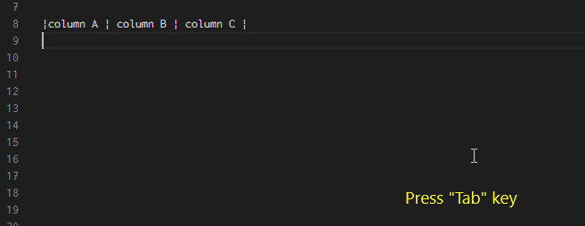

# Markdown Blocks

## **Table of Contents**

* [Lists](#Lists)

  - [Unordered List](#Unordered-List)
  - [Ordered List](#Ordered-List)

* [Blockquotes](#Blockquotes)

  - [Citations](#Citations)

* [Tables](#Tables)

  - [Tables ⟷ Data (Demo)](#Tables⟷Data-(Demo))
  - [Editing](#Editing)

* [HTML](#HTML)

  - [Details & Summary](#Details-&-Summary)
  - [<lia-keep>](#<lia-keep>)

* [Code](#Code)

  - [Differences to Markdown](#Differences-to-Markdown)
  - [Projects](#Projects)
  - [Supported Languages](#Supported-Languages)

* [JavaScript](#JavaScript)

* [Horizontal rules](#Horizontal-rules)

### **Lists**
-----------------

* The GitHub-flavored Markdown supports two types of lists, `ordered list and unordered list`, and so does LiaScript. If you ever used a typewriter then the following syntax for lists would look natural to you. 
* The only thing that matters here is the correct indentation.

> Use spaces for correct indentation! Tabs are allowed too, but might be confusing, since editors tend to use varying lengths from 2 to 4 spaces to display them...

#### **Unordered List**
----------------------

To define an unordered list, starting asterisks `*`, pluses `+`, and dashes `-` can be used and mixed. If one point has more than one line, you can also use multiple lines to define paragraphs. All other Markdown elements, you will get to know, can be included in the same way.

**Markdown-Syntax:**

> asterisk symbol (*) or hyphen symbol (-) or pluse symbol (+)

**Example 1:**

```
* Apple
* Banana
* Orange
* Mango
```
Output:

> * Apple
>
> * Banana
>
> * Orange
>
> * Mango

**Example2:**

```
* Fruits

 - Apple
 - Banana
 - Orange
 - Mango
```

Output:

> * Fruits
> 
>  - Apple
>
>  - Banana
>
>  - Orange
>
>  - Mango

**Example3:**

```
* Apples
+ **Bananas**
- Oranges
  and Lemons

  - Grapefruits
  - and Kiwis

- Pears
```
Output:

>* Apples
>+ **Bananas**
>- Oranges
>  and Lemons
>
>  - Grapefruits
>  - and Kiwis
>
>- Pears

As you can see from the result, you can apply all Markdown styling elements freely. The starting characters will be interpreted equally, thus it makes no difference, if you use asterisks, pluses and dashes. To improve the readability of your document, we would recommend to stick with one format for every level. Starting with asterisks on the first level and dashes within the second level, etc.


```
Note: At the moment it is required to separate blocks by at least one empty line. The following example will be interpreted as a single paragraph
```

```
* separate paragraph

  - and this is a separate sub listing
```

Output:

>* separate paragraph
>
>  - and this is a separate sub listing


#### **Ordered List**
-------------------------

Ordered lists start with a number and a dot. As you can see from the example, the numbering is important. In contrast to the GitHub flavored Markdown or the original Markdown, where the list below would result in two separate lists, and the numbering for every list would start at 1, ignoring your numbering order. With the LiaScript interpretation you can separate your lists, add more explanations in between, or use animations to make certain parts appear or disappear.

**Markdown-Syntax:**

>  start each item with a number followed by a period (.)

**Example1:**

```
1. First item
2. Second item
3. Third item
4. Fourth item
```

Output:

>1. First item
>2. Second item
>3. Third item
>4. Fourth item

**Example2:**

```
1. Introduction
2. Literature Review
3. Methodology
4. Results
5. Discussion
6. Conclusion
```
Output:

>1. Introduction
>2. Literature Review
>3. Methodology
>4. Results
>5. Discussion
>6. Conclusion

**Example3:**

```
1. Start the project
    1. Define project scope
    2. Gather necessary resources
2. Execute the project
    1. Implement plan
    2. Monitor progress
3. Complete the project
    1. Review outcomes
    2. Document results

```

Output:

>1. Start the project
>
>    1. Define project scope
>    2. Gather necessary resources
>
>2. Execute the project
>
>    1. Implement plan
>    2. Monitor progress
>
>3. Complete the project
>
>    1. Review outcomes
>    2. Document results

### **Blockquotes**

The blockquotes refers to the quotes that requires a special attention from the normal text. The blockquotes can be specified using the greater than symbol (>) at the starting line. If you, from time to time, reply to emails, than the following notation will look quite familiar to you.

**Markdown-Syntax:**

>greater than symbol (>)

**Example1:**

```
> This is a blockquote.
> It can span multiple lines.
> Blockquotes are often used to highlight or emphasize text.
```

Output:

>This is a blockquote.
>
>It can span multiple lines.
>
>Blockquotes are often used to highlight or emphasize text.

**Example2:**

```

> This is the outer blockquote.
>
> > This is a nested blockquote inside the outer blockquote.
> >
> > > This is a deeply nested blockquote within the nested blockquote.
>
> Back to the outer blockquote.
```

Output:

> This is the outer blockquote.
>
> > This is a nested blockquote inside the outer blockquote.
> >
> > > This is a deeply nested blockquote within the nested blockquote.
>
> Back to the outer blockquote.


**Example3:**

```
> This was said some time ago ...
>
>> This was said even longer ago,
> > I guess ...
>
> * aleph
> * beth
```

As you can see from the example, all Markdown elements can be used within a blockquote and vice versa. Everything you have learned so far can be easily combined, it could also be a gallery or an embedded object...

Output:

> This was said some time ago ...
>
>> This was said even longer ago,
> > I guess ...
>
> * aleph
> * beth


#### **Citations**
-------------------

Blockquotes are often used for citations, and so do we. You can use the following pattern to mark a blockquote as a citation. Simply use two paragraphs within a blockquote and start the second one with two dashes --.

**LiaScript-Syntax:**
>two dashes --.

**Example1:**

```
> “Live as if you were to die tomorrow.
> Learn as if you were to live forever.”
>
> -- Mahatma Gandhi
                   
```

The resulting blockquote looks slightly different. Furthermore, the paragraph followed by dashes is put into and HTML cite-tag.

> “Live as if you were to die tomorrow.
> Learn as if you were to live forever.”
>
> -- Mahatma Gandhi


You can use this syntax, with starting dashes, everywhere within a LiaScript document and your corresponding paragraph it will be rendered within a cite-tag. But, at this time it will only affect the representation of blockquotes. We are not sure yet, how this can also be applied to images, tables, lists, etc.

 
lorem ipsum ....

-- Some more citations


### **Tables**
--------------------------

Tables, as we hope, are easy to interpret and to create. Simply use horizontal rules to separate cells. The header is always defined by the first line, while the second line is used to separate the table header from the body visually and to define the column alignment.

* In Markdown, you create a table by using pipes | to separate columns and hyphens - to separate the header row from the content rows. Each row is separated by a newline. The pipes and hyphens must align vertically to create a proper table structure.

**Markdown-format:**

```
|  |  |
|--|--|
|  |  |
|  |  |
|  |  |
```

**Example1:**

```
| Fruit    | Quantity | Price |
|----------|----------|-------|
| Apple    | 3        | $1    |
| Banana   | 5        | $0.5  |
| Orange   | 2        | $2    |
```

Output:

>| Fruit    | Quantity | Price |
>|----------|----------|-------|
>| Apple    | 3        | $1    |
>| Banana   | 5        | $0.5  |
>| Orange   | 2        | $2    |


```
centered --> :---:
right --> ---:
left --> :--- or --- (default)
```


**Middle alignment**

**Example2:**

```
|  Fruit         |   Quantity     |  Price (USD)   |
|:--------------:|:--------------:|:--------------:|
|     Apple      |       3        |       $1       |
|    Banana      |       5        |      $0.5      |
|    Orange      |       2        |       $2       |
```

Output:

>|  Fruit         |   Quantity     |  Price (USD)   |
>|:--------------:|:--------------:|:--------------:|
>|     Apple      |       3        |       $1       |
>|    Banana      |       5        |      $0.5      |
>|    Orange      |       2        |       $2       |


**Left alignment**

**Example3:**

```
| Fruit         | Quantity       | Price (USD)   |
|:--------------|:--------------:|--------------:|
| Apple         | 3              | $1            |
| Banana        | 5              | $0.5          |
| Orange        | 2              | $2            |

```

Output:

>| Fruit         | Quantity       | Price (USD)   |
>|:--------------|:--------------:|--------------:|
>| Apple         | 3              | $1            |
>| Banana        | 5              | $0.5          |
>| Orange        | 2              | $2            |

**Right alignment**

**Example4:**

```
| Fruit         | Quantity       | Price (USD)   |
|--------------:|--------------:|--------------:|
| Apple         | 3              | $1            |
| Banana        | 5              | $0.5          |
| Orange        | 2              | $2            |
```

Output:

>| Fruit         | Quantity       | Price (USD)   |
>|--------------:|--------------:|--------------:|
>| Apple         | 3              | $1            |
>| Banana        | 5              | $0.5          |
>| Orange        | 2              | $2            |


**Example4:**

```
| Tables               |      Are      |  Cool |
| -------------------- |:-------------:| -----:|
| *** columns 3 is *** | right-aligned | $1600 |
| **column 2 is**      |   centered    |   $12 |
| *zebra stripes*      |   are neat    |    $1 |

```
As you can see in the result, you can sort tables, by clicking onto the icon that appears on the right of every header cell. A table will then be either sorted ascending, descending, or not sorted, which means your initial row order will be restored.

Output:

>| Tables               |      Are      |  Cool |
>| -------------------- |:-------------:| -----:|
>| *** columns 3 is *** | right-aligned | $1600 |
>| **column 2 is**      |   centered    |   $12 |
>| *zebra stripes*      |   are neat    |    $1 |

The position of the colon defines whether a column should be centered, aligned to the left or to the right. By default, if you do not use colons, all columns are aligned to the left.


#### **Tables <--> Data (Demo)**

* But why stopping here? A table, in many cases, is just a representation of a dataset. If so, why not simply visualizing it accordingly and plot a graph, display a chart or a map, or whatever fits the most for your data. At the moment we apply simple rules to identify the nature of your dataset and thus choose a visual representation.

* For more details have a look at section Fun With Tables, which provides and extensive overview onto all supported representation schemes.

* The easiest and probably most obvious representation of a simple plot, would be the following. A header with some names and columns that contain numbers. The first column is interpreted as the main column and thus defines the x values, the rest is up to you. A cell is then only associated with a number, if the first "word", sequence of characters separated by a space, can be parsed as a number. The 0km within this example gets ignored. So if you want certain values to be ignored, simply attach something directly to the number, or add a character in front of it.


```
| x's |  some y's  |                  dist |
| --- |:----------:| ---------------------:|
| 1   |    1 \$    |                 16 km |
| 2.2 |    2 \$    |                 12 km |
| 3.3 |    5 \$    |                  1 km |
| 4   | -12.333 \$ | 0km _will be ignored_ |
```
                    

LiaScript identifies this pattern and automatically adds a button above the table, which allows to switch between the table and the "line chart" representation. You can modify the chart interactively and even download the resulting image.

>| x's |  some y's  |                  dist |
>| --- |:----------:| ---------------------:|
>| 1   |    1 \$    |                 16 km |
>| 2.2 |    2 \$    |                 12 km |
>| 3.3 |    5 \$    |                  1 km |
>| 4   | -12.333 \$ | 0km _will be ignored_ |


A function cannot possess different y-values for one x-value, thus, if you have two or more equal x-values, the resulting plot will be a scatter plot.

```
| x's |  some y's  |  dist |
| --- |:----------:| -----:|
| 1   |    1 \$    | 16 km |
| 2.2 |    2 \$    | 12 km |
| 3.3 |    5 \$    |  1 km |
| 4   | -12.333 \$ | -5 km |
| 4   |            |     1 |
```


>| x's |  some y's  |  dist |
>| --- |:----------:| -----:|
>| 1   |    1 \$    | 16 km |
>| 2.2 |    2 \$    | 12 km |
>| 3.3 |    5 \$    |  1 km |
>| 4   | -12.333 \$ | -5 km |
>| 4   |            |     1 |


Last but not least bar-charts. If the first column contains at least one cell, that cannot be parsed as a number while the others do have, then this table gets interpreted as a bar-chart. The first column thus defines your set of groups. It is now also possible to sort your table according to different columns, and to see this ordering also within the bar-chart representation.


```
| Animal          | weight in kg | Lifespan years | Mitogen |
| --------------- | ------------:| --------------:| -------:|
| Mouse           |        0.028 |             02 |      95 |
| Flying squirrel |        0.085 |             15 |      50 |
| Brown bat       |        0.020 |             30 |      10 |
| Sheep           |           90 |             12 |      95 |
| Human           |           68 |             70 |      10 |
```

>| Animal          | weight in kg | Lifespan years | Mitogen |
>| --------------- | ------------:| --------------:| -------:|
>| Mouse           |        0.028 |             02 |      95 |
>| Flying squirrel |        0.085 |             15 |      50 |
>| Brown bat       |        0.020 |             30 |      10 |
>| Sheep           |           90 |             12 |      95 |
>| Human           |           68 |             70 |      10 |

As mentioned earlier, this is only a brief introduction into this topic. So check out section Fun With Tables for a complete overview.

#### **Editing**

Editing tables might seem tedious, but actually it is not. There is a huge number of plugins for different editors that you can use, which do the formatting for you. You can use them to quickly navigate through your cells, and some even allow sorting.



**Editors: Plugins**

* Atom:[markdown-table-editor](https://github.blog/2022-06-08-sunsetting-atom/)
* VS-Code:[Markdown Table](https://marketplace.visualstudio.com/items?itemName=TakumiI.markdowntable)
* Obsidion:[Advanced Tables](https://github.com/tgrosinger/advanced-tables-obsidian) 

### **HTML**

You can also use plain HTML in your Markdown, if you miss something. It will mostly work pretty good, but it should be used with caution, since some interpreters apply different rules. Some interpret everything within an HTML tag as HTML, while others allow mixing. Thus, HTML can contain Markdown, which contains HTML, which contains... By the way, LiaScript allows mixing. Thus, keep in mind that newlines and indentation are still relevant.

**Markdown-Syntax:**

```
<div style="color: green">

Test <q>**bold**</q> and <b>HTML bold</b> works also inline


</div>

```

The result shows how the inline-CSS is applied to all nested Markdown elements. However, if you want to apply some styling to your document, LiaScript supports another minimal invasive way of doing that. We will describe this in detail in section Styling.

Result:

<div style="color: green">

Test <q>**bold**</q> and <b>HTML bold</b> works also inline


</div>


>See the following list for an complete overview onto all HTML elements:
>
>HTML Element Reference


If you use custom HTML instead of Markdown, then no styling will be applied. You can of course create more complex content or tables, this way you can apply your own styling to all elements.


[CSS-Reference](https://www.w3schools.com/CSSref/index.php)


If you want to, you can also copy the generated LiaScript structure and use our classes. Most Browsers include an inspector, which can be used to interactively inspect the entire DOM-tree.


Open Inspector: Ctrl+Shift+i or Ctrl+Shift+k

!?[Inspecting the DOM](https://youtu.be/Gk6BljF60RI)

But, you can also import your own styles within the main document comment by using the link definition. We will explain this in more details within the macro section [link](#link).

```
<!--
...
link: file.css
...
-->

# Main Title
```


#### **Details & Summary**

The `details` and `summary` tags are standard HTML tags and GitHub also supports their usage with Markdown. These tags offer a neat way to define something what is nowadays called accordion. Thus, your user can click on the summary text to make the body of the `details`-tag appear.

**Syntax:**

```
<details>

<summary>**Honest Textbook ads (click to enlarge)**</summary>

!?[If High School and College Textbooks Were Honest - Honest Ads](https://www.youtube.com/watch?v=lhSjYT7pWkw)

</details>
```


**Result:**

<details>

<summary>**Honest Textbook ads (click to enlarge)**</summary>

!?[If High School and College Textbooks Were Honest - Honest Ads](https://www.youtube.com/watch?v=lhSjYT7pWkw)

</details>

#### `<lia-keep>`

If you want to embed more complex HTML, and only HTML, without taking care about indentation and formatting, then should use the `lia-keep` tag to surround your code.

```
<`lia-keep`>
  <style>
    table, th, td {
      border: 1px solid black;
      width: 250px; height: 40px;
      text-align: center;
    }
  </style>

  <table style="margin: 1em">
    <tr>
      <th>**Header 1**</th>
      <th>**Header 2**</th>
    </tr>
    <tr>
      <td>Cell 1</td>
      <td rowspan="2">Cell 2</td>
    </tr>
    <tr>
      <td>Cell 3</td>
    </tr>
  </table>
<`/lia-keep`>
```

As it is demonstrated in the result, everything within this tag will be treated as HTML only, no Markdown parsing will be applied and indentation will be checked.

 
Result:


<style> table, th, td { border: 1px solid black; width: 250px; height: 40px; text-align: center; } </style>
**Header 1**	**Header 2**
Cell 1	Cell 2
Cell 3

This way, you could for example also import even more complex HTML-tables, pictures with multiple sources for different screen-sizes, and more. With great power comes great responsibility. Thus, you will also be responsibile for your styling.


### **Code**

In Markdown, you can use a sequence of at least three subsequent backticks  to indicate a code-block that should not be treated as Markdown, but instead contains some kind of code for which syntax-highlighting should be used, if possible. The first word after the backticks is used as an indicator, for which kind of syntax-highlighting should be applied.

``` python
import time
# Quick, count to ten!
for i in range(10):
    # (but not *too* quick)
    time.sleep(0.5)
    print(i)
```

``` python
import time
# Quick, count to ten!
for i in range(10):
    # (but not *too* quick)
    time.sleep(0.5)
    print(i)
```


import time
# Quick, count to ten!
for i in range(10):
# (but not *too* quick)
    time.sleep(0.5)
    print(i)


In case you are wondering, how to embed a code-block into a code-block with backticks? Three backticks are the minimum, thus you can surround your Markdown code-block example with a sequence of 4 or more backticks. If you start with four backticks, LiaScript will parse everything as code until it reaches a matching number of backticks.


However, we are still in the Markdown world with static code visualization. LiaScript has also support for interactive programming, thus all of your code-snippet can be made executable and editable. This will be described in more detail in section Interactive Coding.


#### **Differences to Markdown**

-----------

Markdown also supports adding code by using tilde `~` characters instead of backticks. This is at the moment not supported by LiaScript, but might be added in the future.

```
~~~ javascript
var a = "b"
~~~
```

Additionally, it is also possible in standard Markdown to use indentation with at least 4 spaces to mark a block or a line as code. In LiaScript this is treated differently. You can use indentation to keep your document readable. The two indicators for text-to-speech in the example are treated equally by LiaScript, but another Markdown interpreter will interpret the second example as a single paragraph, while the indicator in the first example will be treated as code, and thus be easier to read with any other Markdown interpreter (including the representation on GitHub).


```
This is not code ...

    Any kind of text with a 4 space
    indentation will be treated as code
    in Markdown ...

                --{{1}}--
This text will be spoken out loud in LiaScript.

--{{2}}--
This text will be spoken out loud too.
```